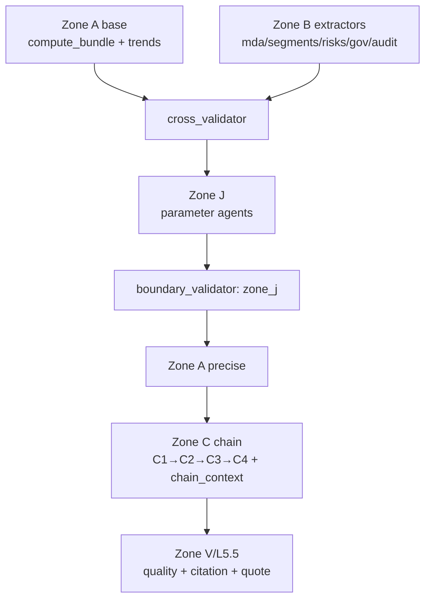

# V5 系统架构：三区收敛模型（A+B+J+C+V）

> 最后更新：2026-07-10 | 状态：设计阶段 v5.4（收敛 Zone 边界 + Industry Context 并入 Zone A）

---

## 0. 根因诊断：信息贫乏 vs 幻觉

### 失败史

```
V1：LLM 读整份年报 → 边读边算边写
    失败模式：数字"漂移"（上下文里出现多个相似数字，LLM 混淆）
              万字年报超出注意窗口，远端数字被遗忘后"推断"出来

V2/v3.0：Python 从 DB 计算 → LLM 只拿到 compute_bundle.json 写报告
    失败模式：DB 只有三大报表 + 基础数据（股本/派息）
              LLM 上下文里没有：管理层叙述、分部数据、风险事项、护城河
              → 报告空洞，没有定性分析，信息量远低于人工阅读年报
```

### 信息量对比（具体化）

| 信息类别 | v3.0 提供了吗 | 来源 | 重要性 |
|---------|:---:|------|------|
| 因子2/3/4 定量（GG, DDM, λ, 仓位） | ✅ | compute_bundle.py | 核心 |
| 5年财务趋势（同比、CAGR、利润率） | ❌ | 待建 build_financial_trends.py | 高 |
| 管理层对本年业绩的解释 | ❌ | 年报 MDA | 高 |
| 分部收入/利润结构 | ❌ | 年报 SEG | 高 |
| 核心业务运营指标（在管面积、门店数等） | ❌ | 年报 MDA/P3 | 高 |
| 前瞻：管理层指引、资本开支计划 | ❌ | 年报 MDA | 中 |
| 会计质量旗帜（应收账龄、受限现金） | ❌ | 年报 P2/P3 | 高 |
| 关联方交易透明度 | ❌ | 年报 P4 | 中 |
| 重大或有事项、未决诉讼 | ❌ | 年报 P6 | 中 |
| 审计师意见、持续经营段落 | ❌ | 年报审计报告 | 高 |
| 非经常性项目说明 | ❌ | 年报 P13 | 中 |
| 护城河/商业模式定性 | ❌ | 综合判断 | 中 |

**v3.0 只提供了约 3/13 类信息。** 这是报告空洞的根本原因，不是写报告的 LLM 能力问题。

### 核心矛盾

```
老方法：让 LLM 读原始年报 → 信息丰富，但数字幻觉
新方法：让 Python 喂数字  → 数字准确，但信息贫乏

错误假设：这是二选一。
正确认知：这是两件不同的事，应分开处理。
```

---

## 1. V5 三区模型总览

```
┌─────────────────────────────────────────────────────────────────┐
│  输入层                                                          │
│  stock_analysis.db（三大报表 + 基础数据）                        │
│  annual_report.pdf（MDA、附注、分部等定性内容）                  │
└───────────────────────────┬─────────────────────────────────────┘
                            │
        ┌───────────────────┼───────────────────┐
        ▼                                       ▼
┌───────────────────────┐           ┌───────────────────────┐
│  ZONE A：Python 计算区 │           │  ZONE B：LLM 提取区    │
│  （零幻觉）            │           │  （低幻觉，可校验）     │
│                       │           │                       │
│  compute_bundle.py    │           │  5个独立 Extractor    │
│  → compute_bundle.json│           │  每个只读1-3页定向文本  │
│                       │           │  输出严格 JSON schema  │
│  build_financial_     │           │  每个数字字段必须附     │
│  trends.py            │           │  verbatim quote（原引） │
│  → financial_trends   │           │                       │
│    .json              │           │  输出 5个 JSON 文件    │
└───────────┬───────────┘           └──────────┬────────────┘
            │                                  │
            └──────────────┬───────────────────┘
                           ▼
            ┌──────────────────────────────┐
            │  交叉验证层                   │
            │  cross_validator.py          │
            │  Zone B 数值 vs Zone A 数值   │
            │  偏差 >5% → Zone A 胜出+WARN  │
            └──────────────┬───────────────┘
                           ▼
            ┌──────────────────────────────┐
            │  ZONE C：LLM 写作区           │
            │                              │
            │  report_assembler.py         │
            │  将 Zone A + Zone B 组装为    │
            │  单一 report_context.json    │
            │                              │
            │  LLM 只看 report_context     │
            │  物理上看不到原始 PDF/DB      │
            │  → 分析报告_v5.md            │
            └──────────────┬───────────────┘
                           ▼
            ┌──────────────────────────────┐
            │  验证层 L5.5                  │
            │  citation_verifier.py        │
            │  报告中的数字 vs 来源 JSON    │
            │  偏差 >1% → WARN             │
            └──────────────────────────────┘
```

**设计原则：**
- Zone A 负责所有数字的准确性（Python 从 DB 计算，无 LLM 参与）
- Zone B 负责所有定性内容的结构化（LLM 从 PDF 小段落提取，有 quote 约束）
- Zone C 的 LLM 只做"翻译+综合"，不做"读原文找数字"
- Zone A 永远优先于 Zone B（数字冲突时 Zone A 胜出）

### 1.1 V5+ 收敛后的 Zone 边界

V5 的长期形态不是继续增加大 Zone，而是在三区基础上明确两类补充层：Zone J（参数化判断）与 Zone V/L5.5（验证）。纯 Python/SQL 的横向行业洞察归入 Zone A，不再单独膨胀为新的大 Zone。

| Zone | 职责 | 执行者 | 允许输出 | 禁止输出 |
|------|------|--------|----------|----------|
| **A：确定性计算与洞察** | 单股计算、财务趋势、行业横向分位、同业筛选 | Python/SQL | `compute_bundle.json`、`financial_trends.json`、`industry_context.json` | LLM 判断、报告结论 |
| **B：结构化年报提取** | 从年报小窗口提取事实、quote、证据 | LLM + schema | `mda/segments/risks/governance/audit.json` | 估值结论、投资建议 |
| **J：参数化语义判断** | 将 A+B 证据转成参数、flags、confidence | LLM + schema | 参数值、证据引用、quote、置信度 | `moat_rating`、自然语言 rationale、报告可直接复用的结论 |
| **C：报告写作链** | 基于白名单 JSON 与 `chain_context.json` 写报告 | LLM | 报告正文、结构化 handoff | 自行读 PDF/DB、自行计算硬数字 |
| **V/L5.5：验证层** | 边界验证、数字溯源、quote 回检、质量门 | Python | validation reports | 自动修正投资结论 |

**收敛原则**：
1. 不新增大 Zone 承载纯 Python/SQL 能力；行业横向分析属于 Zone A 的 `industry_context` 子模块。
2. Zone J 只能输出“参数 + 证据 + 置信度”，不能输出可被 Zone C 直接抄写的叙事结论。
3. Zone C 的多 Agent 链必须通过结构化 `chain_context.json` 传递关键结论；`CHAIN_NEXT` 只作为拼接/人工流程标记。
4. DAG 是演进方向，但必须先锁定 schema、boundary、handoff，再升级调度器。

---

## 2. Zone A：Python 确定性计算区

### 2.1 compute_bundle.py（已完成）

- **输入**：`stock_analysis.db` → `annual_financials` 表
- **计算**：因子 2（R_NP, R_OE）、因子 3（AA, GG三档, λ三档, 误差传播）、因子 4（DDM, 阶梯买入, 价值陷阱, 仓位）、全部否决门
- **输出**：`compute_bundle.json`

### 2.2 build_financial_trends.py（待建，P1）

- **输入**：`stock_analysis.db` → `annual_financials` 表（5年数据）
- **计算**：

  | 指标组 | 具体字段 |
  |--------|---------|
  | 利润表趋势 | 收入 YoY%、CAGR、毛利率、净利润率、归母净利润 YoY% |
  | 资产负债表趋势 | ROE、资产负债率、有息负债率、现金覆盖率 |
  | 现金流量趋势 | OCF/净利润比、自由现金流、Capex/收入比 |
  | 运营效率 | 应收账款天数（DSO）、存货周转、资产周转率 |
  | 趋势信号（规则引擎） | 毛利率连续下滑≥3年、应收恶化（DSO+10天以上）、OCF/NP持续<0.8、ROE拐点 |

- **输出**：`financial_trends.json`

  ```json
  {
    "period": ["2020", "2021", "2022", "2023", "2024"],
    "income_statement": {
      "revenue": [1000, 1200, 1150, 1300, 1450],
      "revenue_yoy_pct": [null, 20.0, -4.2, 13.0, 11.5],
      "gross_margin_pct": [35.0, 36.2, 33.1, 34.5, 35.8]
    },
    "cash_flow": {
      "ocf_to_np_ratio": [1.12, 0.98, 1.23, 1.05, 1.18]
    },
    "signals": [
      {"type": "WARN", "code": "DSO_RISING", "detail": "DSO 从 45 天升至 67 天（3年）"}
    ]
  }
  ```

---

## 3. Zone B：LLM 结构化提取区

### 3.1 为什么 LLM 结构化提取优于正则

| 维度 | 正则提取（现有） | LLM 结构化提取（V5） |
|------|---------|---------------|
| 覆盖率 | ~40%（固定句式） | ~90%（语义理解，处理变体） |
| 跨语言 | 需要繁简双份正则 | 原生支持繁简中英混合 |
| 维护成本 | 高（每家公司措辞不同） | 低（同一 schema 适用所有 ticker） |
| 幻觉风险 | 无 | **低**（quote 约束 + 小窗口 + schema 限制发明空间） |
| 可验证性 | 可以（结果确定性） | 可以（quote 字段可回溯到原文） |

### 3.2 防幻觉三原则

1. **小窗口**：每个 Extractor 只读 1-3 页定向文本段落（pdf_preprocessor.py 已完成定向切片），不读全文
2. **quote 强制**：每个数字/事实字段必须附 `quote`（原文中包含该信息的完整句子），无 quote → 字段拒绝
3. **schema 硬约束**：LLM 只能填 schema 规定的字段，不允许 schema 外的内容

### 3.3 五个 Extractor 规格

#### Extractor 1：MDA 提取器（`mda_extractor.py`）

| 属性 | 值 |
|------|----|
| **输入** | `pdf_sections["MDA"]`（pdf_preprocessor 已切片，≤24,000 chars，缩减到 ≤8,000 用于提取） |
| **输出** | `mda.json` |
| **文本预算** | 8,000 字符（中心截断，保留关键词周围的段落） |

输出 schema：
```
year_highlights: [{item, amount_m, change_pct, quote}]  ← 本年度3-5个核心业绩点
key_metrics: [{name, value, unit, yoy_change, quote}]    ← 核心运营指标（在管面积/门店数/用户数等）
mgmt_explanation: [{topic, content, quote}]              ← 管理层对收入/利润变化的解释
forward_guidance: [{item, detail, quote}]                ← 资本开支计划、预期目标
strategy_changes: [{item, detail, quote}]                ← 战略变化、新业务布局
```

#### Extractor 2：分部提取器（`segment_extractor.py`）

| 属性 | 值 |
|------|----|
| **输入** | `pdf_sections["SEG"]`（≤5,000 chars） |
| **输出** | `segments.json` |

输出 schema：
```
segments: [{
  name, revenue_m, revenue_yoy_pct, gross_profit_m, gross_margin_pct,
  quote, confirmed_by_db: bool  ← Python 交叉校验后填入
}]
total_revenue_check_m: float  ← 各分部之和，与 DB 值核对
```

#### Extractor 3：风险与会计质量提取器（`risk_extractor.py`）

| 属性 | 值 |
|------|----|
| **输入** | `pdf_sections["P3"]`（AR 账龄，≤6,000 chars）+ `pdf_sections["P6"]`（或有事项，≤6,000 chars） |
| **输出** | `risks.json` |

输出 schema：
```
ar_aging: [{bucket_label, amount_m, pct_of_total, provision_pct, quote}]
ar_total_m: float
contingent_liabilities: [{type, counterparty, amount_m, status, quote}]
pending_litigation: [{description, amount_m, status, quote}]
capital_commitments_m: float
```

#### Extractor 4：关联方治理提取器（`governance_extractor.py`）

| 属性 | 值 |
|------|----|
| **输入** | `pdf_sections["P4"]`（关联方，≤12,000 chars） |
| **输出** | `governance.json` |

输出 schema：
```
related_party_transactions: [{
  party_name, relationship, transaction_type,
  amount_m, pricing_basis, quote
}]
total_related_party_revenue_m: float
related_party_revenue_pct: float
transparency_flag: "clean" | "elevated" | "high"
```

#### Extractor 5：审计与非经常项提取器（`audit_extractor.py`）

| 属性 | 值 |
|------|----|
| **输入** | 审计报告首页（≤3,000 chars）+ `pdf_sections["P13"]`（非经常项，≤6,000 chars） |
| **输出** | `audit.json` |

输出 schema：
```
auditor: string
audit_opinion: "clean" | "qualified" | "adverse" | "disclaimer"
going_concern_paragraph: bool
key_audit_matters: [{matter, quote}]
non_recurring_items: [{description, amount_m, nature, quote}]
non_recurring_total_m: float
```

### 3.4 Zone B prompt 模板（通用）

```
你是数据提取器，不是分析师。

【你的唯一任务】
从以下 {section_name} 原文段落中提取结构化数据，输出 JSON。
不做分析，不做推断，不做计算。原文没有提到的字段填 null。

【目标 schema】
{schema_json}

【强制规则】
1. 每个数字字段格式：{"value": <数字>, "unit": "<单位>", "quote": "<原文中包含该数字的完整句子>"}
2. 每个文本字段格式：{"value": "<原文确切文本>", "quote": "<上下文句子>"}
3. 如果原文没有明确提到，填 null，绝对不要推断
4. 只提取 {fiscal_year} 财年数据；如果原文同时提到去年和今年，提取今年的
5. 单位统一为百万元（港币 / 人民币按原文）；如果原文用"千元"或"亿元"，转换后标注

【原文 ({fiscal_year} 年 {section_name})】
{raw_text}
```

---

## 4. 交叉验证层

```python
# cross_validator.py 逻辑（伪代码）
def cross_validate(zone_b_json, zone_a_db):
    for field in CROSS_CHECK_FIELDS:
        b_val = zone_b_json.get(field)
        a_val = zone_a_db.get(field)
        if b_val and a_val:
            deviation = abs(b_val - a_val) / a_val
            if deviation > 0.05:
                zone_b_json[field]["override"] = a_val
                zone_b_json[field]["warn"] = f"Zone B={b_val:.1f}, Zone A={a_val:.1f}, 偏差{deviation:.1%}，已替换为 Zone A 值"
```

可交叉校验的字段（Zone B 提取 vs Zone A DB）：

| Zone B 字段 | Zone A 来源 |
|------------|-----------|
| `segments.total_revenue_check_m` | `annual_financials.revenue` |
| `risks.ar_total_m` | `annual_financials.accounts_receiv` |
| `audit.non_recurring_total_m` | `annual_financials.non_recurring_net_profit`（若有） |
| `governance.total_related_party_revenue_m` | — |

---

## 5. Zone C：报告组装与 LLM 写作

### 5.1 report_assembler.py 的职责

把 Zone A + Zone B 的 JSON 文件组装成单一的 `report_context.json`，然后构建报告 prompt。

**物理边界**：`report_assembler.py` 的文件读取白名单只包含以下文件，代码层面禁止读取任何其他文件（PDF/CSV/data_pack.md 等）：

| 文件 | 来源 | 提供内容 |
|------|------|---------|
| `compute_bundle.json` | Zone A | GG, DDM, λ, 仓位, 否决门 |
| `financial_trends.json` | Zone A | 5年趋势表 + 比率 + 趋势信号 |
| `mda.json` | Zone B | 管理层叙述、运营指标、前瞻 |
| `segments.json` | Zone B | 分部收入/利润结构 |
| `risks.json` | Zone B | AR 账龄、或有事项 |
| `governance.json` | Zone B | 关联方交易 |
| `audit.json` | Zone B | 审计意见、非经常项 |

**组装后信息量**：预计 report_context.json 包含约 100-150 个结构化字段（vs v3.0 的 ~20 个字段）。

### 5.2 Zone C LLM 任务定位

| 任务 | v3.0 | V5 |
|------|------|-----|
| 读取原始数据 | 需要（无其他选择） | 禁止（物理边界） |
| 计算财务指标 | 需要（部分） | 禁止（Zone A 已完成） |
| 综合定性判断 | 有限（数据不足） | 有（Zone B 提供了足够素材） |
| 叙述+写作 | 核心任务 | 核心任务 |

Zone C LLM 的角色是"持有完整信息的分析师撰写报告"，而不是"从原始数据中挖掘信息的研究员"。

### 5.3 L5.5 Citation Verifier

报告生成后，Python 正则提取报告中所有数字，逐一对照7个输入 JSON 文件验证。偏差 >1% → WARN，追加到 `verification_report.json`。

---

## 6. PDF 获取策略（A 股 vs 港股）

当前 DB 有三大报表但无 MDA/定性数据，Zone B 依赖年报 PDF。

| 股票类型 | PDF 来源 | 脚本 | 备注 |
|---------|---------|------|------|
| 港股 | HKEX CCASS / 公司 IR 页面 | `download_report.py` | 已有 |
| A 股 | 巨潮资讯 cninfo.com.cn | `download_report.py` (cninfo-first) | 已有 |

Zone B 提取前的前置条件检查：
```
if not exists(f"output/{code}/annual_report_{year}.pdf"):
    → 提示用户运行 /download-annual-report
    → 或跳过 Zone B，降级为 v3.0 模式（只有 Zone A 数字）
```

**降级契约**：PDF 不可用时，Zone B 全部字段填 `null`，Zone C 照常运行，但在相应章节标注 `⚠️ 年报未上传，定性分析不可用`。

---

## 7. 全管道编排

```
run_pipeline.py --code 01502.HK --year 2024

  Step 0: 前置检查
    ├── DB 有数据？ → 否则 STOP（提示运行数据采集）
    └── PDF 存在？ → 否则降级模式（Zone B 跳过）

  Step 1: Zone A（并行运行）
    ├── compute_bundle.py → compute_bundle.json
    └── build_financial_trends.py → financial_trends.json

  Step 2: Zone B（并行运行，需要 PDF）
    ├── mda_extractor.py   → mda.json
    ├── segment_extractor.py → segments.json
    ├── risk_extractor.py  → risks.json
    ├── governance_extractor.py → governance.json
    └── audit_extractor.py → audit.json

  Step 3: 交叉验证
    └── cross_validator.py → 修正 Zone B 中与 Zone A 偏差>5% 的字段

  Step 4: Zone C
    ├── report_assembler.py → report_context.json
    └── LLM → 分析报告_v5.md

  Step 5: 验证
    └── citation_verifier.py → verification_report.json
```

---

## 8. 实现优先级

| 优先级 | 任务 | 解决什么问题 | 预计信息增量 |
|--------|------|------------|-----------|
| **P0** | `citation_verifier.py` | 当前 Zone C 输出无数字验证，最大盲点 | — |
| **P1** | `build_financial_trends.py` | 5年趋势表从无到有 | +30个字段 |
| **P1** | Zone B 5个 Extractor | 定性信息从无到有 | +80个字段 |
| **P1** | `report_assembler.py`（物理边界） | 用代码约束替代 prompt 约束 | — |
| **P2** | `cross_validator.py` | Zone B 数字质量保障 | — |
| **P2** | `run_pipeline.py` | 单命令跑全流程 | — |
| **P3** | 规则引擎（rule_engine.py + signals.yaml） | 趋势信号检测自动化 | — |

---

## 9. 实现进度

| 组件 | Zone | 状态 |
|------|------|------|
| `import_hk_bulk.py` / `migrate_to_db.py` | — | ✅ |
| `db_init.py` / `data_gate.py` | — | ✅ |
| `compute_bundle.py` | A | ✅（硬编码 P0 已修复） |
| `build_financial_trends.py` | A | ✅ |
| `compute_bundle_precise.py` | A | ✅（7参数调整，DDM 4.26→4.38） |
| Zone B 提取框架 | B | ✅ `zone_b_extractor.py` + 5 JSON |
| Zone J 判断框架 | J | ✅ `zone_j_agent.py` + 4 JSON（J1-J4） |
| Zone C 4-Agent 链 | C | ✅ `zone_c_chain.py`（C1 9模块，C2同业对标） |
| `citation_verifier.py` | L5.5 | ✅（V5.2: 86.1%） |
| `report_assembler.py`（物理边界+剥离叙事） | C | ✅ |
| `cross_validator.py` | B→C | ✅ 内嵌于 zone_b_extractor.py |
| `boundary_validator.py` | P2 | ✅（Zone B/J/A 全 PASS） |
| `overrides.json` 系统 | P2 | ✅（空模板+compute_bundle_precise集成） |
| 增量缓存（cache_meta） | P2 | ✅（sha256+时间戳） |
| `rule_engine.py`（10规则） | P3 | ✅（8/10信号触发） |
| `run_pipeline.py` | — | ✅ |
| `signals.yaml`（声明式规则文件） | P3 | ⏳ 内嵌于 rule_engine.py，可后续外置 |

---

## 10. V5.1 升级：Zone J 判断层（Hybrid Judgment）

> 本节是对原始三区设计的重要增补，解决 v5 报告信息量仅为旧版 1/5 的根本问题。

### 10.1 差距诊断（实测数据）

对比对象：`金融街物业_01502_分析报告.md`（旧版 Agent 链）vs `金融街物业_01502_分析报告_v5.md`

| 指标 | 旧版（Agent 链） | V5（三区模型） | 差距 |
|------|:---:|:---:|:---:|
| 文件大小 | 127 KB | 27 KB | **4.7x** |
| 行数 | 2,429 行 | 539 行 | **4.5x** |
| 因子 1B 深度 | ~800 行（9个模块） | ~50 行（4个小节） | **16x** |
| 因子 1C 增量 ROIC | ~350 行 | 0 行 | **完全缺失** |
| 因子 3 AA 推理链 | ~250 行（13步） | ~30 行（直接引表） | **8x** |
| 因子 2 详细分析 | ~380 行 | ~25 行 | **15x** |

### 10.2 信息量差距的根因

**表面原因**：Zone C LLM 写报告时"没有素材可写"。

**真正原因**：compute_bundle.py 对以下判断全部使用了硬编码默认值：

| 判断项 | 现状 | 应有做法 |
|--------|------|---------|
| AA 计算口径 | AA = OCF - Capex（全量） | 需要识别维持性 vs 扩张性 Capex |
| B 类业务惩罚 | `b_penalty = 0.25`（硬编码） | 需要分析分部毛利 + 护城河质量后决定 |
| g_base | `g_base = 2.0`（硬编码） | 需要结合 MDA 指引 + 收入质量判断 |
| 非经常项分类 | 不做 | 需要区分"保留项"（利息收入）vs"扣除项"（一次性亏损） |
| AR 质量检查 | 不做 | 需要检查收款比率是否异常（AR 增速 > 收入增速） |
| AP 超额融资 | 不做 | 需要计算 DPO 是否拉长 |
| 数据折价 | 不做 | 需要评估数据来源质量（Big 4 / 非 Big 4、PDF vs Tushare 等） |
| 因子 1B 护城河深度 | 不做 | 需要 Agent 完成竞争格局 9 个模块 |
| 因子 1C 增量 ROIC | 不做 | 需要 Capex 类型分类 + 增量 ROIC 计算 |

**架构缺陷的根源**：三区设计把"判断"和"计算"都放进 Zone A（Python），但有些判断需要语义理解，Python 做不到。结果要么硬编码，要么直接跳过。

### 10.3 Zone J：混合判断层（新增）

**定位**：Zone J 不做写作，不做最终计算。它只做一件事：**把需要语义判断的参数从"硬编码默认值"变成"有理由的推断值"**，并将推断过程保存为 JSON（供 Zone C 报告引用）。

```
                     Zone B 提取完毕后
                           ↓
         ┌──────────────────────────────────┐
         │          Zone J：判断层           │
         │  （4个独立 Agent，各做一件事）    │
         │                                  │
         │  J1: moat_agent                  │
         │      → moat_assessment.json      │
         │      （护城河 + B类识别 + g_base）│
         │                                  │
         │  J2: capex_classifier_agent      │
         │      → capex_classification.json │
         │      （MCapex分拆 + 1C类型分类）  │
         │                                  │
         │  J3: earnings_quality_agent      │
         │      → earnings_quality.json     │
         │      （AR质量 + AP检查 + 非经常项）│
         │                                  │
         │  J4: data_quality_agent          │
         │      → data_discount.json        │
         │      （数据折价 + 置信度评估）    │
         └──────────────────────────────────┘
                           ↓
              Zone A 精算（有参数化输入）
           compute_bundle_precise.py
           → compute_bundle_v2.json（精算结果）
                           ↓
                        Zone C
            （同时读取 compute_bundle_v2 + Zone J 推理链）
            → 能写出步骤1-13的完整推理
```

### 10.4 四个 Zone J Agent 规格

#### J1：moat_agent（护城河 + g_base 判断）

| 属性 | 规格 |
|------|------|
| **输入** | `segments.json` + `financial_trends.json`（毛利率趋势） + `mda.json`（战略意图） |
| **上下文预算** | ~5,000 tokens |
| **输出** | `moat_assessment.json` |
| **绝对禁止** | 推断财务数字（全用Zone A数据）；输出散文（只输出 JSON） |

`moat_assessment.json` schema：
```json
{
  "moat_rating": "strong | moderate | weak | none",
  "moat_sources": [{"type": "品牌/规模/切换成本/网络效应/成本优势/...", "evidence": "...", "durability": "5年以上/3-5年/不确定"}],
  "b_class_segments": [{"name": "...", "revenue_pct": 0.034, "margin_pct": -0.061, "classification": "B-劣/B-中/A", "penalty_pct": 0.25}],
  "b_penalty_final": 0.20,
  "b_penalty_rationale": "...",
  "g_base": 2.0,
  "g_base_rationale": "...",
  "g_scenarios": {"pessimistic": 0.0, "base": 2.0, "optimistic": 3.5},
  "value_trap_signals": ["...", "..."]
}
```

#### J2：capex_classifier_agent（Capex 分类 + 因子 1C）

| 属性 | 规格 |
|------|------|
| **输入** | `financial_trends.json`（Capex序列、D&A序列）+ `mda.json`（Capex 用途说明） |
| **上下文预算** | ~4,000 tokens |
| **输出** | `capex_classification.json` |

`capex_classification.json` schema：
```json
{
  "capex_type": "light_asset | heavy_asset | mixed",
  "mcapex_split_pct": 0.80,
  "mcapex_rationale": "...",
  "growth_classification": {
    "A_class_pct": 0.60,
    "B_class_pct": 0.30,
    "C_class_pct": 0.10,
    "rationale": "..."
  },
  "incremental_roic": [
    {"period": "FY2022-FY2024", "delta_np_m": 120.0, "delta_invested_capital_m": 85.0, "roic_pct": 141.2, "classification": "A"}
  ]
}
```

> 注：`capex_classification.json` 直接解锁因子 1C 分析（增量 ROIC），Zone C 可基于此写完整的因子 1C 章节。

#### J3：earnings_quality_agent（收益质量检查）

| 属性 | 规格 |
|------|------|
| **输入** | `financial_trends.json`（AR序列、AP序列、OCF/NP比率）+ `risks.json`（AR账龄）+ `audit.json`（非经常项） |
| **上下文预算** | ~4,000 tokens |
| **输出** | `earnings_quality.json` |

`earnings_quality.json` schema：
```json
{
  "ar_quality": {
    "collection_ratios": [{"year": "FY2024", "ratio": 0.949, "flag": "WARN", "reason": "AR增速27.7%>>收入增速15.6%"}],
    "ar_adjustment_needed": true,
    "adjustment_years": ["FY2024"]
  },
  "ap_excess_check": {
    "dpo_by_year": [{"year": "FY2024", "dpo_days": 171}],
    "excess_financing_flag": false,
    "rationale": "..."
  },
  "non_recurring_items": {
    "keep": [{"item": "利息收入", "reason": "持续性收入"}],
    "exclude": [{"item": "FY2022衍生品亏损61.88M", "reason": "一次性，非现金"}],
    "net_adjustment_m": -61.88
  },
  "ocf_quality_flags": ["FY2022 OCF畸高（216M）因AP大幅增加113M，属一次性"]
}
```

#### J4：data_quality_agent（数据折价评估）

| 属性 | 规格 |
|------|------|
| **输入** | `financial_trends.json`（数据完整度标记）+ Zone B 所有文件的 `_provenance` 块 |
| **上下文预算** | ~2,000 tokens |
| **输出** | `data_discount.json` |

`data_discount.json` schema：
```json
{
  "discount_factors": [
    {"factor": "港股数据完整性", "discount_pct": 5, "rationale": "BS部分字段依赖PDF提取"},
    {"factor": "毛利率预测不确定性", "discount_pct": 8, "rationale": "FY2026中报是关键锚点"},
    {"factor": "审计质量（非Big 4）", "discount_pct": 2, "rationale": "致同，5年无保留意见"}
  ],
  "total_discount_pct": 15,
  "confidence_by_section": {
    "factor2": "high",
    "factor3_aa": "medium",
    "factor3_gg": "medium",
    "factor4_ddm": "medium"
  }
}
```

### 10.5 精算层：compute_bundle_precise.py

在 Zone J 全部完成后，运行精算脚本（接受 Zone J 输出作为参数覆盖）：

```python
# compute_bundle_precise.py（伪代码逻辑）
moat     = load_json("moat_assessment.json")
capex_j  = load_json("capex_classification.json")
eq       = load_json("earnings_quality.json")
discount = load_json("data_discount.json")

# AA 精算：用 Zone J 的 mcapex_split + AR 调整
for year in years:
    mcapex = capex[year] * capex_j["mcapex_split_pct"]
    cash_revenue = revenue[year] - ar_delta[year]  # eq["ar_quality"]["ar_adjustment_needed"]
    aa_precise[year] = ocf[year] - mcapex  # 精确 AA

# GG 精算：用 Zone J 的 g_base + B 惩罚
b_penalty = moat["b_penalty_final"]
g_adj     = moat["g_scenarios"]["base"] * (1 - b_penalty)
gg_base   = (aa3y / mc) * (1 - discount["total_discount_pct"] / 100)

# 输出 compute_bundle_v2.json（含精算轨迹）
```

Zone C 读取 `compute_bundle_v2.json` 时，同时拿到精算数字和每个参数的 rationale — 这正是旧版报告"步骤1-13"丰富性的来源。

### 10.6 更新后的完整管道

```
run_pipeline_v2.py --code 01502.HK --year 2024

  Step 0：前置检查
    ├── DB 有数据？→ 否则 STOP
    └── PDF 存在？→ 否则降级（跳过 Zone B + Zone J）

  Step 1：Zone A 基础计算（并行）
    ├── compute_bundle.py → compute_bundle_base.json  ← 仅作参考，不直接用于报告
    └── build_financial_trends.py → financial_trends.json

  Step 2：Zone B 提取（并行，需要 PDF）
    ├── mda_extractor.py → mda.json
    ├── segment_extractor.py → segments.json
    ├── risk_extractor.py → risks.json
    ├── governance_extractor.py → governance.json
    └── audit_extractor.py → audit.json

  Step 3：交叉验证
    └── cross_validator.py → 修正 Zone B 数值偏差

  Step 4：Zone J 判断（并行）               ← 新增
    ├── moat_agent → moat_assessment.json
    ├── capex_classifier_agent → capex_classification.json
    ├── earnings_quality_agent → earnings_quality.json
    └── data_quality_agent → data_discount.json

  Step 5：Zone A 精算（依赖 Zone J）        ← 新增
    └── compute_bundle_precise.py → compute_bundle_v2.json

  Step 6：Zone C
    ├── report_assembler.py → report_context.json
    │   （读取：compute_bundle_v2 + financial_trends + Zone B all + Zone J all）
    └── LLM → 分析报告_v5.md

  Step 7：验证
    └── citation_verifier.py → verification_report.json
```

### 10.7 更新后的实现优先级

| 优先级 | 任务 | Zone | 解锁的报告章节 | 信息增量 |
|--------|------|------|--------------|---------|
| **P0** | `citation_verifier.py` | L5.5 | 全部 | 数字质量保障 |
| **P1** | `build_financial_trends.py` | A | 财务趋势速览 | +30 字段 |
| **P1** | Zone B 5个 Extractor | B | 因子1A、趋势速览 | +80 字段 |
| **P1** | `moat_agent`（J1） | J | **因子1B**（护城河深度） | +800 行 |
| **P1** | `capex_classifier_agent`（J2） | J | **因子1C**（增量ROIC，从0到有） | +350 行 |
| **P1** | `earnings_quality_agent`（J3） | J | **因子3 AA步骤1-7** | +200 行 |
| **P1** | `compute_bundle_precise.py` | A | 因子2/3/4 精算 | 精度提升 |
| **P1** | `report_assembler.py`（物理边界） | C | 全部 | 架构完整性 |
| **P2** | `data_quality_agent`（J4） | J | 因子3数据折价 | +50 行 |
| **P2** | `cross_validator.py` | B→C | 隐式质量 | 幻觉防护 |
| **P2** | `run_pipeline_v2.py` | — | — | 自动化 |
| **P3** | 规则引擎 | A | 趋势信号 | 自动发现 |

### 10.8 设计约束（Zone J 防幻觉规则）

Zone J 与 Zone B 共享防幻觉规则，但有额外约束：

1. **Zone J 不做财务计算**：所有数字运算（DPO、增量ROIC、AA精算）由 Python 完成；Zone J 只输出参数（split_pct、penalty_pct）和理由
2. **Zone J 输出必须可参数化**：每个判断字段必须有对应的数值参数（供 Python 使用），不允许只有文字说明
3. **Zone J 分歧处理**：如果 Zone J 输出的 b_penalty 与 compute_bundle_base.json 的默认值偏差>50%，`compute_bundle_precise.py` 额外输出 WARN
4. **Zone J 上下文隔离**：每个 Agent 只读自己 schema 指定的输入文件；禁止读取原始 PDF 或 DB

### 10.9 最终架构层次图

```
┌─────────────────────────────────────────────────────────────────┐
│ 输入                                                             │
│ stock_analysis.db  │  annual_report.pdf                         │
└────────────┬───────┴───────┬─────────────────────────────────────┘
             │               │
     ┌───────▼───────┐  ┌────▼────────────────┐
     │    Zone A     │  │       Zone B         │
     │  Python基础   │  │  LLM结构化提取       │
     │  计算（无LLM）│  │  (5个 Extractor)     │
     └───────┬───────┘  └────┬────────────────┘
             │               │
             └───────┬────────┘
                     │  交叉验证
                     ▼
             ┌───────────────────┐
             │     Zone J        │  ← v5.1 新增
             │  混合判断层       │
             │  (4个 Agent)      │
             │  只输出参数+理由  │
             └───────┬───────────┘
                     ▼
             ┌───────────────────┐
             │   Zone A 精算     │  ← v5.1 新增
             │  compute_bundle_  │
             │  precise.py       │
             └───────┬───────────┘
                     ▼
             ┌───────────────────┐
             │     Zone C        │
             │  LLM 写报告       │
             │  (有完整推理链)   │
             └───────┬───────────┘
                     ▼
             ┌───────────────────┐
             │   验证 L5.5       │
             │ citation_verifier │
             └───────────────────┘
```

**V5.1 的本质改进**：Zone J 把"隐藏在 Python 硬编码里的判断"显式化为有理由的 JSON 参数，Zone C LLM 读到的不再是冷冰冰的数字，而是"数字 + 每个数字从哪来、为什么这么定"——这才是旧版 Agent 链报告丰富性的真正来源。

---

## 11. V5.2 升级：Zone C 必须是多 Agent 链（最关键发现）

> 本节是对 Zone J 之后最重要的架构修正，直接解释为什么 v5 报告只有 27KB 而旧版有 127KB。

### 11.1 根本原因：单次 LLM 调用的深度上限

阅读 `coordinator.md` v2.25 后，揭示了旧版报告丰富性的真正来源：

```
旧版 coordinator.md 策略：
  Agent 1：写因子1A + 1B（~1200 行，全部9个模块）
  Agent 2：写因子1C + 因子2（~800 行）
  Agent 3：写因子3步骤1-13（~1200 行）
  Agent 4：写因子4 + 最终输出（~1000 行）
  总计：4 × 1000 行 = 4000-5000 行

当前 V5 策略：
  Agent C1（唯一）：一次性写全部因子（~539 行）
```

**核心结论**：Zone C 的问题不是数据不足，而是**用一次 LLM 调用做了四个 Agent 的工作**。任何 LLM，在一次输出中写五个复杂因子，都会被迫压缩每个因子的深度。

| 调用次数 | 每因子深度 | 总深度 | 质量 |
|---------|-----------|--------|------|
| 1次（当前 V5） | 浅（50-100 行/因子） | 539 行 | 信息量不足 |
| 4次（旧版链） | 深（800-1200 行/因子） | 4500 行 | 丰富但数字幻觉 |
| **4次（V5.2 目标）** | **深 + 结构化输入** | **~4000 行** | **丰富且无数字幻觉** |

### 11.2 Zone C 重构为 4-Agent 链

```
Zone C Agent 1 (C1)：因子1A + 1B深度
  读取：financial_trends.json + mda.json + segments.json + governance.json + moat_assessment.json
  目标：~1200 行
  输出：因子1A快筛 + 因子1B全部9模块（含护城河、管理层、周期性等）
  占位符：末尾写 CHAIN_NEXT: FACTOR1C

Zone C Agent 2 (C2)：因子1C + 因子2
  读取：capex_classification.json + financial_trends.json + compute_bundle_v2.json
  目标：~800 行
  输出：因子1C增量ROIC + 因子2穿透粗算
  占位符：末尾写 CHAIN_NEXT: FACTOR3

Zone C Agent 3 (C3)：因子3精算（步骤1-13）
  读取：compute_bundle_v2.json + earnings_quality.json + data_discount.json
  目标：~1200 行
  输出：步骤1-13 完整推理链（AA序列、B类惩罚、GG三档、λ、误差传播）
  占位符：末尾写 CHAIN_NEXT: FACTOR4

Zone C Agent 4 (C4)：因子4 + 最终输出
  读取：compute_bundle_v2.json + 报告已有内容（Executive Summary）
  目标：~1000 行
  输出：DDM、阶梯买入、仓位、综合输出、风险提示
  最终：回扫 Executive Summary，移除所有占位符
```

**关键改进**：每个 Zone C Agent 只读与自己负责的因子相关的 JSON，Context 精简 → 可以把全部注意力用在深度写作上。

### 11.3 Zone C 每 Agent 的 Context 隔离规则

| Agent | 读取文件 | 禁止读取 | Context 预算 |
|-------|---------|---------|------------|
| C1 | financial_trends + mda + segments + governance + moat_assessment | compute_bundle, risks, capex | ~8,000 tokens |
| C2 | capex_classification + financial_trends + compute_bundle_v2 | mda, segments, governance | ~6,000 tokens |
| C3 | compute_bundle_v2 + earnings_quality + data_discount + risks | mda, segments, governance | ~7,000 tokens |
| C4 | compute_bundle_v2 + 报告.md（只读因子1-3结论段） | 所有 Zone B/J 原始数据 | ~8,000 tokens |

---

## 12. 硬编码市场数据问题（紧急修复）

### 12.1 发现的 Bug

`compute_bundle.py` 的主函数 `compute()` 硬编码了特定股票的市场数据：

```python
# Line 658-661 in compute_bundle.py
price_hkd = 1.96        # ← 01502.HK 硬编码
shares_m = 373.5         # ← 01502.HK 硬编码
fx = 0.9346              # ← 固定汇率，非实时

# Line 688
"dps_latest": 0.157,    # ← 01502.HK 硬编码
```

**影响**：用 `compute()` 函数分析任何非 01502.HK 的股票，市值计算完全错误。`compute_from_db()` 函数（line 826）已修复此问题，但 `compute()` 函数未修复。

### 12.2 修复方案

`compute()` 函数应从以下来源读取市场数据（优先级顺序）：

1. `params_override` 中显式传入
2. `stock_analysis.db` → `stocks` 表（`price_hkd`, `shares_m`, `currency`）
3. `data_pack_market.md` §2 段落解析
4. `threshold.json` 中的市场字段
5. 报错退出（不使用任何硬编码值）

```python
# 修复后的 compute() 应有这一段
if params_override and "price_hkd" in params_override:
    price_hkd = params_override["price_hkd"]
elif db_stock := load_stock_from_db(ts_code):
    price_hkd = db_stock["price_hkd"]
else:
    raise ValueError(f"无法获取 {ts_code} 的当前价格，请通过 params_override 传入")
```

---

## 13. 判断覆盖系统（Judgment Override）

### 13.1 问题

Zone J 输出是 LLM 推断值，可能存在错误。分析师需要能够覆盖这些判断，且覆盖应在同一股票的未来分析中持久化。

### 13.2 设计

在每个标的目录下新增 `overrides.json`：

```json
// output/01502_金融街物业/overrides.json
{
  "_comment": "人工覆盖 Zone J 输出。此文件优先级高于 Zone J 任何 Agent 的输出。",
  "_last_modified": "2026-07-09",
  "_modified_by": "analyst",
  "moat_assessment": {
    "moat_rating": "moderate",
    "_reason": "餐饮业务持续亏损，外部客户占比仍低，护城河不如纯物管强"
  },
  "capex_classification": {
    "mcapex_split_pct": 0.70,
    "_reason": "管理层FY2025年报说明有新项目扩张Capex约150M，非维持性"
  }
}
```

**加载逻辑**（在 Zone A 精算前）：

```python
# compute_bundle_precise.py
overrides = load_overrides(output_dir)  # returns {} if file not exist
moat = deep_merge(moat_assessment_json, overrides.get("moat_assessment", {}))
# deep_merge: overrides 的字段覆盖 Zone J 输出，非覆盖字段保留 Zone J 值
```

**规则**：
- `overrides.json` 不存在 → 完全使用 Zone J 输出（零影响）
- `overrides.json` 存在 → 仅覆盖指定字段，其余字段保留 Zone J 值
- Zone C 报告中标注 `[人工覆盖]` 标签，指明哪些判断来自分析师

### 13.3 覆盖 vs 重跑

| 场景 | 推荐操作 |
|------|---------|
| 单个判断字段错误（如 b_penalty 太高） | 写入 `overrides.json`，重跑 Zone A 精算 + Zone C |
| Zone J 数据读取了错误的 PDF 段落 | 修复 Zone B 提取结果，重跑 Zone J |
| 整个分析过时（新年报发布） | 重跑全流程（清除 Zone B/J 缓存） |

---

## 14. 编排 DAG：先显式依赖与可观测性，后完整调度器

> 设计结论：DAG 是正确方向，但不应先重写调度器。先把每个节点的 inputs/outputs/validation/degradation/cache state 显式化，再引入 `--graph` 可观测性，最后才演进为真正并行 DAG executor。

### 14.1 目标依赖关系

```
  [DB + PDF]
      │
      ├─────────────────────────────────┐
      │                                 │
      ▼                                 ▼
 [Zone A 基础]                    [Zone B 提取]
  (并行)                           (并行，5个)
  compute_bundle_base.py           mda_extractor
  build_financial_trends.py        segment_extractor
      │                            risk_extractor
      │                            governance_extractor
      │                            audit_extractor
      │                                 │
      └──────────────┬──────────────────┘
                     │ 交叉验证
                     ▼
             [cross_validator.py]
                     │
      ┌──────────────┼──────────────┐
      │              │              │
      ▼              ▼              ▼
 [Zone J-1]     [Zone J-2]     [Zone J-3/4]
 moat_agent    capex_agent    eq_agent / dq_agent
  (并行，各自独立，不互相依赖)
      │              │              │
      └──────────────┼──────────────┘
                     │
                     ▼
          [Zone A 精算：compute_bundle_precise.py]
          (依赖 Zone J-1/2/3 全部完成)
                     │
                     ▼
          [Zone C 写作 Agent 链：顺序执行]
           C1 → C2 → C3 → C4
                     │
                     ▼
            [citation_verifier.py]
```

### 14.2 渐进式实施路线

| 阶段 | 目标 | 说明 |
|------|------|------|
| **I：显式依赖** | 保留现有顺序 runner，但每步声明 inputs / outputs / validators / degradation | 先解决“为什么跳过/阻塞/降级”不可见的问题 |
| **II：`--graph` 可观测性** | 输出 Mermaid DAG，标注 DONE / MISSING / BLOCKED / DEGRADED / CACHE_HIT / MANUAL_REQUIRED | 用于调试，不改变执行语义 |
| **III：内容哈希缓存** | 基于输入 hash 与 prompt version 判断是否重跑 | 解决多层缓存失效传播 |
| **IV：真正 DAG executor** | 在契约稳定后再并行调度 Zone A/B/J | 避免把未稳定的边界复杂化 |

示例 `--graph` 输出：



**关键并行化收益**：

| 阶段 | 顺序执行时间 | 并行执行时间 | 节省 |
|------|:---:|:---:|:---:|
| Zone A 基础 + Zone B 5个提取器 | ~8 分钟 | ~3 分钟（并行） | 5 分钟 |
| Zone J 4个 Agent | ~8 分钟 | ~2 分钟（并行） | 6 分钟 |
| Zone C 4个 Agent | ~8 分钟 | ~8 分钟（顺序，必须） | — |
| **总计** | ~24+ 分钟 | **~15 分钟** | **~9 分钟** |

---

## 15. 边界验证（JSON Schema Validation）

### 15.1 为什么需要

Zone J 的 `moat_agent` 输出 `"b_penalty_final": 0.2`，但 `compute_bundle_precise.py` 读取时期望字段名为 `"b_penalty"`——**静默失败**，Python 读到 `None`，计算出错，没有任何报错。

### 15.2 设计

每个 Zone 输出文件有对应的 JSON Schema（存储在 `schemas/` 目录）：

```
schemas/
  zone_b_mda.schema.json
  zone_b_segments.schema.json
  zone_b_risks.schema.json
  zone_b_governance.schema.json
  zone_b_audit.schema.json
  zone_j_moat_assessment.schema.json
  zone_j_capex_classification.schema.json
  zone_j_earnings_quality.schema.json
  zone_j_data_discount.schema.json
  zone_a_compute_bundle_v2.schema.json
```

在三个关键边界处运行验证：

```python
# boundary_validator.py (伪代码)
def validate_zone_b_outputs(output_dir: str) -> ValidationResult:
    """在 cross_validator.py 运行前验证所有 Zone B 输出。"""
    for name, schema_file in ZONE_B_SCHEMAS.items():
        data = load_json(f"{output_dir}/{name}.json")
        errors = jsonschema.validate(data, load_schema(schema_file))
        if errors:
            return FAIL(f"{name}.json 不符合 schema：{errors}")
    return PASS

def validate_zone_j_outputs(output_dir: str) -> ValidationResult:
    """在 compute_bundle_precise.py 运行前验证所有 Zone J 输出。"""
    ...

def validate_zone_a_precise(output_dir: str) -> ValidationResult:
    """在 Zone C 运行前验证 compute_bundle_v2.json。"""
    ...
```

**验证失败处理**：
- `MISSING_FIELD` → 用该字段的降级默认值填充，标注 WARN
- `WRONG_TYPE` → 尝试强制转换，失败则 BLOCK
- `OUT_OF_RANGE` → 标注 WARN，继续（不阻止分析）

### 15.3 Zone J 硬契约：参数层，不是叙事层

Zone J 是“语义判断 → 参数”的边界层，不是报告草稿生成器。它的输出一旦携带可直接抄写的结论，Zone C 就会停止推理、只写摘要，导致报告深度下降。

**允许字段类型**：

| 类型 | 示例 | 用途 |
|------|------|------|
| 参数值 | `b_penalty_final`, `g_base`, `mcapex_split_pct` | 供 Zone A precise 精算 |
| 结构化证据 | `moat_evidence[]`, `value_trap_signals[]` | 供 Zone C 自行推理 |
| 原文引用 | `quote`, `source_section`, `evidence_refs` | 可追溯性 |
| 置信度/flags | `confidence`, `data_quality_flags` | 降级与风险提示 |
| provenance | `_provenance`, `input_hash`, `prompt_version` | 审计与缓存 |

**禁止字段类型**：

| 禁止类型 | 示例 | 原因 |
|----------|------|------|
| 评级结论 | `moat_rating: "narrow"` | 应由 Zone C 基于证据推导 |
| 自然语言 rationale | `b_penalty_rationale`, `growth_classification.rationale` | 容易成为报告现成段落 |
| 投资建议 | `recommendation`, `buy/sell/hold` | 越过最终综合输出边界 |
| 总结段 | `summary`, `conclusion`, `methodology_note` | 会污染 Zone C 深度分析 |

**Schema 规则**：
- Zone J schema 默认使用 allowlist，并设置 `additionalProperties: false`。
- 如兼容期必须保留历史 `rationale` 字段，只能作为内部审计字段存在，必须被 boundary/report allowlist 隔离，**不得进入 Zone C prompt**。
- `boundary_validator.py --boundary zone_j` 必须在 `compute_bundle_precise.py` 之前执行；失败时优先 BLOCK 或降级到 Zone A base 默认参数。
- Zone C 输入侧 redaction 只是第二道防线，不能替代 Zone J schema 源头约束。

---

## 16. 增量运行（Staleness-Based Incremental Pipeline）

### 16.1 问题

每次重新分析一只股票，所有 Zone B/J Agent 都重新运行，即使输入文件（PDF 和 DB 数据）没有变化，浪费 Token 和时间。

### 16.2 基于内容哈希的缓存

每个 Zone 输出文件旁边存储一个 `.cache_meta` 文件：

```json
// output/01502_金融街物业/mda.json.cache_meta
{
  "input_hash": "sha256:abc123...",   // 输入文件（pdf_sections_2024.json + mda prompt）的哈希
  "prompt_version": "zone_b_mda_v1.2",
  "model": "claude-opus-4-8",
  "generated_at": "2026-07-09T12:30:00Z"
}
```

**重运行决策规则**：

```python
def should_rerun(output_file: str, input_files: list[str], prompt_version: str) -> bool:
    meta_file = f"{output_file}.cache_meta"
    if not exists(meta_file) or not exists(output_file):
        return True  # 不存在 → 必须运行
    meta = load_json(meta_file)
    current_hash = hash_files(input_files)
    if meta["input_hash"] != current_hash:
        return True  # 输入变了（新年报/新DB数据）
    if meta["prompt_version"] != prompt_version:
        return True  # Prompt 更新了
    return False     # 缓存有效 → 跳过
```

**强制刷新选项**：

```bash
# 只刷新 Zone J（用于分析师更新判断逻辑后）
python3 scripts/run_pipeline_v2.py --code 01502.HK --force-rerun zone_j

# 只刷新 Zone B（用于更新年报 PDF 后）
python3 scripts/run_pipeline_v2.py --code 01502.HK --force-rerun zone_b

# 全量重跑（忽略所有缓存）
python3 scripts/run_pipeline_v2.py --code 01502.HK --force-rerun all
```

**缓存节省估算**（重跑同一股票的 Zone C 写作，Zone B/J 数据未变）：

| 重跑场景 | 无缓存 Token | 有缓存 Token | 节省 |
|---------|:---:|:---:|:---:|
| Zone C 写作调整 | ~150,000 | ~30,000 | **80%** |
| 更新 GG 参数后重算 | ~120,000 | ~40,000 | **67%** |
| 新年报发布后全跑 | ~150,000 | ~150,000 | 0%（合理） |

---

## 17. 完整 V5.2 架构总结

V5.0 → V5.1 → V5.2 演进：

| 版本 | 核心改进 | 解决的问题 |
|------|---------|---------|
| v3.0 | Python Zone A 计算 | 消除数字幻觉 |
| **V5.0** | 三区模型（A+B+C） | 引入 Zone B 结构化提取 |
| **V5.1** | 新增 Zone J 判断层 | 解决 AA 计算硬编码问题 |
| **V5.2** | Zone C 多 Agent 链 + 工程化 | **解决信息量不足问题（27KB→120KB）** |

V5.2 完整架构下，一份报告的预计质量：

| 维度 | v3.0 | 旧版 Agent 链 | V5.2 目标 |
|------|:---:|:---:|:---:|
| 文件大小 | 27KB | 127KB | ~120KB |
| 数字准确性 | ⭐⭐⭐⭐⭐ | ⭐⭐ | ⭐⭐⭐⭐⭐ |
| 定性深度 | ⭐ | ⭐⭐⭐⭐⭐ | ⭐⭐⭐⭐⭐ |
| 可复现性 | ⭐⭐⭐⭐⭐ | ⭐⭐ | ⭐⭐⭐⭐ |
| 运行时间 | 3 min | 25 min | ~15 min |
| Token 消耗 | 低 | 高 | 中（+缓存优化） |

**V5.2 实现优先级更新**：

| 优先级 | 任务 | 预期收益 |
|--------|------|---------|
| **P0 URGENT** | 修复 `compute_bundle.py` 硬编码市场数据 Bug | 不修复则非01502股票计算全错 |
| **P0** | `citation_verifier.py` | 数字质量保障 |
| **P1 核心** | Zone C 重构为4-Agent 链 | 报告从 27KB → 120KB（最大收益） |
| **P1** | `build_financial_trends.py` | 财务趋势章节 |
| **P1** | Zone B 5个 Extractor | 定性素材 |
| **P1** | Zone J 4个 Agent | AA 推理链 + 护城河深度 |
| **P1** | `compute_bundle_precise.py` | 精算层 |
| **P1** | `report_assembler.py`（物理边界 + 多 Agent） | 架构完整性 |
| **P2** | 边界验证（JSON Schema） | 静默失败防护 |
| **P2** | 判断覆盖系统（`overrides.json`） | 专家校正持久化 |
| **P2** | 增量运行（内容哈希缓存） | 重跑成本降低 80% |
| **P2** | `run_pipeline.py --graph` 可观测性 | 调试依赖/降级/缓存状态 |
| **P2** | 显式依赖元数据（inputs/outputs/validators） | 为后续 DAG 做契约准备 |
| **P3** | 并行 DAG executor（契约稳定后） | 运行时间缩短 9 分钟 |
| **P3** | 规则引擎（signals.yaml） | 趋势信号自动化 |

---

## 18. V5.3 实测对比诊断（50KB vs 127KB）

> 来源：对比 `金融街物业_01502_分析报告_v5.2.md`（50KB/850行）与 `金融街物业_01502_分析报告.md`（127KB/2429行）的结构差异。

### 18.1 各 Agent 达成率

| Agent | 实际行数 | 目标行数 | 达成率 | 状态 |
|-------|:---:|:---:|:---:|------|
| C1（因子1A+1B） | 232 | 1,200 | **19%** | 需重建 |
| C2（因子1C+2） | 164 | 800 | **21%** | 需加深 |
| C3（因子3） | 165 | 1,200 | **14%** | 质量可接受，深度不足 |
| C4（因子4） | 222 | 1,000 | **22%** | 需加深 |

> 注：C3 因子 3 结构完整（AA序列→真实收入→AP检查→B类惩罚→GG三档→Lambda→误差传播→净现金保护→否决门），计算过程正确，是 V5.2 中质量最接近旧版的部分。**C3 不是优先修复目标。**

### 18.2 根因一：Zone J 输出"结论"导致 Zone C 只写摘要（最关键）

这是当前 V5.2 与旧版报告深度差距的核心原因：

```
Zone J 当前行为（错误）：
  moat_assessment.json → moat_rating: "narrow", b_penalty_rationale: "核心商务物管...综合惩罚20%..."
  C1 读到 → "护城河评级为narrow，因为..." （写 20 行完事）

Zone J 应有行为（正确）：
  moat_assessment.json → b_class_segments: [...], moat_evidence: [...], g_base: 2.0
  （只有证据和数值参数，无叙事结论）
  C1 读到证据 → 自己推理出护城河评级，过程写 200 行
```

**机制**：旧版 Agent 直接读 PDF 原文 → 必须自己推理 → 天然产出长文。V5.2 Agent 读到的是 Zone J 的预设结论 → 直接抄答案 → 天然产出短文。这与"LLM 不遵守行数目标"无关，是信息输入形式决定了输出深度。

**修正原则**：

| Zone J 应提供（参数+证据） | Zone J 不应提供（叙事结论） |
|---|---|
| `b_penalty_final: 0.20` | `"综合B类惩罚20%，低于默认25%，因为...的质量支撑"` |
| `mcapex_split_pct: 0.80` | `"建议将80%Capex视为维持性，理由是..."` |
| `b_class_segments: [{name, margin_pct, classification}]` | `"非商务物业属于B-中类，护城河评级为窄..."` |
| `g_base: 2.0` | `"g_base应为2.0%，因为行业进入存量竞争..."` |
| `moat_evidence: [{type, quote, durability}]` | `moat_rating: "narrow"` ← 让 Zone C 推导这个 |

Zone J 的自然语言 `rationale` 字段不再作为推荐设计。参数来源应优先用 `evidence_refs`、`source_facts`、`quote`、`confidence` 等结构化字段表达；如兼容期必须保留历史 `rationale`，它只能作为内部审计字段，必须被 boundary/report allowlist 隔离，**不得传入 Zone C 的写作 prompt**。Zone C 只接收参数值、结构化 flags 和原始证据，不接收 Zone J 的叙述性结论。

### 18.3 根因二：C1 模板缺少关键模块

旧版因子 1B 有 9个结构化模块，新版只有 4 个平铺小节：

| 旧版模块 | 新版覆盖 | 差距 |
|---------|---------|------|
| **模块〇**：数据校验+口径锚定+AP/AR基线检查 | **完全缺失** | AP/AR 比例表、利润口径决策表、广义/狭义现金定义 |
| **模块一**：资本消耗强度 | 部分在 2.1 | Capex/D&A 覆盖率表，轻资产量化判断 |
| **模块二**：收款模式 | 部分在 2.1 | 收款天数 vs 付款天数，现金循环周期计算 |
| **模块三**：竞争格局与护城河（10子项） | 压缩进 2.1 | 同业对标4家（含PE/PB/股息率/在管面积）、定价权验证、产业链议价能力、「租来的护城河」检查、护城河vs价值陷阱区分 |
| **模块四**：周期性 | **完全缺失** | 收入/利润波动量化表，外部变量依赖度，周期位置判断 |
| **模块五**：人力资本依赖 | **完全缺失** | 系统型vs个人型判断 |
| **模块六**：管理层与治理 | 在 2.2（薄） | 激励机制评估，并购整合能力量化验证 |

**模块〇特别说明**：这个模块在旧版中承担"分析基础校准"的作用——确定利润口径、现金口径、AP/AR 比例基线——后续所有因子的计算都以此为基础。它的缺失导致报告没有分析校准段落，因子 2/3 使用的口径显得"无中生有"。

### 18.4 根因三：内容要求 vs 行数要求

C1 提示词目前使用行数目标（`≥200行`），LLM 对数字型约束天然不遵守。应改为内容要求：

```
❌ 错误：### 2.1 商业模式与护城河 (≥200行)

✅ 正确：### 模块三：竞争格局与护城河
核心问题：凭什么别人打不进来？护城河多宽？
必须包含：
- 市场结构表（集中度/进入壁垒/公司地位）
- 非技术护城河逐项评估表（规模/网络/切换成本/品牌/成本优势）
- 技术护城河逐项评估表（数据壁垒/算法/系统/AI）
- 同业对标表（4家竞品，含PE/PB/股息率/在管面积/毛利率）
- 定价权验证表
- 产业链议价能力表（上游分包商/上游劳动力/下游B端/下游C端）
- 护城河侵蚀风险表
- 护城河vs价值陷阱判断
```

用"必须包含XX表格"替代"≥N行"，LLM 为了满足表格要求会自然产出足够的内容。

### 18.5 修正后的 C1 模板结构

```
## 二、因子 1B：深度定性分析

### 模块〇：数据校验与口径锚定
必须包含：
  ① 异常扫描表（FY2021-FY2025，标注 YoY >30% 或利润率变动 >5pp，上限3条）
  ② AP/AR 比例基线检查表（5年，AP/AR比例，判断是否触发 >9x 警告）
  ③ 利润口径锚定（GAAP归母/扣非/经营利润三选一，给出选择理由）
  ④ 现金口径决策（广义/狭义现金，区分受限存款）

### 模块一：资本消耗强度
核心问题：维持当前盈利规模需要持续投入多少资本？
必须包含：Capex/营收表（5年）、Capex/D&A表（5年）、资本消耗判断

### 模块二：收款模式
核心问题：一笔典型交易的现金流时间线是怎样的？是否垫资？
必须包含：交易现金流时间线、AR天数/AP天数/合同负债/现金循环周期表、收款模式判断

### 模块三：竞争格局与护城河
核心问题：凭什么别人打不进来？护城河多宽？
必须包含：3.1市场结构表、3.2非技术护城河评估表、3.3技术护城河评估表、
  3.4两层交互关系、3.5定量绑定数据、3.5-bis同业对标表（4家）、
  3.6定价权验证、3.7产业链议价、3.8侵蚀风险、3.9「租来的护城河」检查、
  3.10护城河vs价值陷阱区分、护城河综合判断

### 模块四：周期性
核心问题：盈利对经济周期的敏感度如何？
必须包含：收入/利润波动量化表（5年）、外部变量依赖度表、周期位置判断

### 模块五：人力资本依赖
核心问题：核心竞争力依赖关键人才还是系统性能力？
必须包含：人员结构分析（高层/中层/基层占比）、系统性能力沉淀评估、判断

### 模块六：管理层与治理
必须包含：治理结构、激励机制评估、并购记录+商誉历史表、关联方透明度、管理层评级

---
CHAIN_NEXT:FACTOR1C
```

### 18.6 Zone J 输出格式修正

`moat_assessment.json` 修正后的 schema：

```json
{
  // ✅ 保留（数值参数，Zone C 使用）
  "b_penalty_final": 0.20,
  "g_base": 2.0,
  "g_scenarios": {"pessimistic": 0.0, "base": 2.0, "optimistic": 3.5},
  "b_class_segments": [
    {"name": "非商务物业", "revenue_pct": 0.43, "margin_pct": 8.08, "classification": "B-中", "penalty_pct": 0.15}
  ],

  // ✅ 保留（证据，Zone C 用来推理）
  "moat_evidence": [
    {"type": "品牌", "quote": "品牌价值47.38亿，百强第14位", "durability": "5年以上"},
    {"type": "切换成本", "quote": "商务物管合同通常2-3年，客户更换成本高", "durability": "3-5年"}
  ],
  "value_trap_signals": ["毛利率连续6年下滑", "增收不增利"],

  // ❌ 删除（叙事结论，不传入 Zone C prompt）
  // "moat_rating": "narrow",            ← 删除，让 C1 自己推导
  // "b_penalty_rationale": "综合...",   ← 删除，rationale 只存本文件供audit，不入prompt
  // "g_base_rationale": "存量竞争..."   ← 删除
}
```

**report_assembler.py 实现规则**：读取 `moat_assessment.json` 时，剥离所有 `*_rationale` 和 `*_rating` 字段，只传入数值参数和 `moat_evidence` 到 Zone C prompt。

### 18.7 更新后的优先级

| 优先级 | 任务 | 预期效果 |
|--------|------|---------|
| **P0** | Zone J moat_agent：删除叙事输出，改为证据+参数 | C1 深度从 170行 → 600行+ |
| **P0** | C1 模板：重建为 9模块，改内容要求取代行数要求 | C1 结构覆盖从 4节 → 9模块 |
| **P0** | 补充模块〇（数据校验/口径锚定） | 消除报告分析基础缺失 |
| **P1** | C2 模板：增加同业对标数据入口 | 因子1C对标分析完整 |
| **P1** | report_assembler.py：剥离 Zone J 叙事字段再入 prompt | 架构保证，不依赖 JSON 维护 |
| **P2** | C3/C4 维持现有深度 | 质量已可接受 |

---

## 19. V5.3 第二轮实测对比（精确行数分析）

> 实测对比：`金融街物业_01502_分析报告_v5.2.md`（44KB/769行）vs 旧版（127KB/2429行）

### 19.1 逐章行数对比

| 章节 | 旧版 | v5.2 | 倍差 | 状态 |
|------|:---:|:---:|:---:|------|
| 财务趋势速览 | 235 | 15 | **15.7x** | 🔴 最大差距 |
| 因子1A | 41 | 31 | 1.3x | ✅ 已接近 |
| 因子1B | 709 | 167 | **4.2x** | 🟡 结构对，深度不足 |
| 因子1C | 356 | 71 | **5.0x** | 🔴 缺步骤化 |
| 因子2 | 425 | 49 | **8.7x** | 🔴 严重不足 |
| 因子3 | 239 | 164 | 1.5x | ✅ 已接近 |
| 因子4 | 129 | 100 | 1.3x | ✅ 已接近 |
| 最终综合输出 | 52 | 75 | 0.7x | ✅ 超了 |
| 风险提示 | 39 | 47 | 0.8x | ✅ 超了 |

**1,660行差距来源**：因子1B(33%) + 因子2(23%) + 因子1C(17%) + 财务趋势(13%) + 其他(14%)

### 19.2 财务趋势速览根因（15.7x差距）

旧版财务趋势速览包含：完整IS/BS/CF逐行表格（5年）、收入结构演变表、分业务毛利率表、分红历史、关键运营指标、**盈利预测与毛利率企稳分析（含三情景）**。

v5.2只有一个9行汇总表，因为：
1. `financial_trends.json` 有完整数据，但只传入了 summary 字段给 Zone C
2. **财务趋势速览没有专门的 Zone C Agent 负责**——它夹在元信息和因子1A之间，被遗漏

**修复**：为财务趋势速览增加专门的 Zone C 处理，完整展开 financial_trends.json 中的全量表格数据（IS/BS/CF各表，分业务毛利，运营指标），预期+180行。

### 19.3 因子2根因（8.7x差距）

旧版因子2有7个步骤：
1. 方法论适用性检查（OCF/NP表+特殊行业豁免）
2. 详细参数读取（含G系数选择逻辑+Capex/D&A历史）
3. Owner Earnings粗算（含G系数应用）
4. 分配能力验证（FCF历史表+现金上游障碍检查）
5. 穿透回报率计算（含支付率+回购+跨币种）
6. 否决门
7. **Q税率三档敏感性分析**（Q=0/10/20%下的R(NP)变化）

v5.2只有步骤1（1行）+步骤2-3（OE表）+步骤5结论+步骤6，缺失 G系数选择、Q税率敏感性、分配能力详细验证。

**修复**：C2的因子2 prompt需要明确列出7个步骤为required content，预期+300行。

### 19.4 因子1B根因（4.2x差距，结构已对）

10模块结构已完整（模块〇-9）。剩余差距来自两类问题：

**A. 同业对标数据缺失**：模块3的3.5-bis显示⚠️占位符（需万物云/碧桂园服务/保利物业等PE/PB/股息率/在管面积数据）

**B. 模块3缺required tables**：
- 非技术护城河逐项评估表（6行×5列：规模/网络/切换/品牌/成本/监管 × 存在性/强度/证据/趋势/判断）
- 技术护城河逐项评估表
- 产业链议价能力表（上游分包/劳动力/下游B端/C端 × 议价能力/依据）
- 护城河侵蚀风险表

**修复**：① 增加 `peers.json` 数据文件（外部数据）；② C1 prompt模块3明确required tables。

### 19.5 因子1C根因（5.0x差距）

旧版有5个步骤，v5.2缺失：
- 步骤2：**非经常性项目清洗**（逐年剔除一次性项目，调整NP）
- 步骤4：**增长来源归因**（每笔Capex的A/B/C分类，含具体投资说明）
- 步骤5：跨因子参数传播（因子1C→因子3 g_base的参数手递）

**修复**：C2的因子1C prompt需要明确5步骤的required content，预期+200行。

### 19.6 已接近旧版的章节（无需大改）

| 章节 | 状态 | 备注 |
|------|:---:|------|
| 因子1A | ✅ 1.3x | 基本完整 |
| 因子3 | ✅ 1.5x | 计算过程正确，少量深度提升 |
| 因子4 | ✅ 1.3x | 基本完整 |
| 最终综合输出 | ✅ 超旧版 | v5.2反而更详细 |
| 风险提示 | ✅ 超旧版 | v5.2反而更详细 |

### 19.7 修复优先级

| 优先级 | 任务 | 预期增加 | 实现复杂度 |
|--------|------|:---:|:---:|
| **P0** | 财务趋势速览专门Agent：展开IS/BS/CF完整表格 | +180行 | 低（数据已在JSON） |
| **P0** | C2因子2：增加7步骤required content（含Q税率敏感性） | +300行 | 低（prompt修改） |
| **P1** | C2因子1C：增加非经常项清洗+增长来源归因步骤 | +200行 | 低（prompt修改） |
| **P1** | C1模块3：增加required tables（护城河/产业链） | +100行 | 低（prompt修改） |
| **P2** | peers.json：提供同业对标数据 | +60行 | 高（需外部数据） |
| **P3** | 缺失章节：风险汇总+因子1B汇总输出 | +89行 | 中 |

---

## 20. V5.3 第三轮实测对比（63KB/1,062行 vs 旧版 127KB/2,429行）

### 20.1 版本演进

| 版本 | 大小 | 行数 | vs旧版 |
|------|:---:|:---:|:---:|
| v5 | 27KB | 539 | 22% |
| v5.2 (旧目录) | 44KB | 769 | 32% |
| **v5.2_final (本次)** | **63KB** | **1,062** | **44%** |
| 目标 | ~120KB | ~2,400 | 100% |

### 20.2 逐章精确行数

| 章节 | 旧版 | 本次 | 状态 |
|------|:---:|:---:|------|
| 财务趋势速览 | 235 | 0 | ❌ 完全缺失 |
| Executive Summary | 56 | 0 | ❌ 完全缺失 |
| 关键假设汇总 | 20 | 0 | ❌ 完全缺失 |
| 因子1B汇总输出 | 40 | 0 | ❌ 完全缺失 |
| 风险汇总与数据局限 | 49 | 0 | ❌ 完全缺失 |
| 因子1A | 41 | 62 | ✅ 已超旧版 |
| 因子1B | 709 | 281 | 🟡 结构好，深度仍不足 |
| 因子1C | 356 | 144 | 🟡 主要内容有，缺step detail |
| 因子2 | 425 | 92 | 🔴 最大瓶颈（G系数/Q税率缺失） |
| 因子3 | 239 | 241 | ✅ 已对齐 |
| 因子4 | 129 | 124 | ✅ 已对齐 |
| 最终综合输出 | 52 | 54 | ✅ 已对齐 |
| 风险提示 | 39 | 50 | ✅ 已超旧版 |

### 20.3 已稳定达标的章节

因子1A / 因子3 / 因子4 / 最终综合输出 / 风险提示 均已与旧版对齐或超过。这些章节**不需要进一步修改**。

因子1B模块〇的 BS恒等式验证新增（旧版没有）、模块3护城河四层分析含star评分和竞争数据比旧版更系统。

### 20.4 剩余差距分析

**400行：完全缺失章节**（财务趋势速览/Executive Summary/关键假设汇总/因子1B汇总/风险汇总）
**333行：因子2薄弱**（现有92行，缺G系数选择逻辑+Q税率三档敏感性，合计约100行）
**428行：因子1B薄弱**（结构正确，各模块每项20-30行vs旧版50-200行）
**212行：因子1C薄弱**（缺非经常项清洗步骤和增长来源归因详细表）

### 20.5 P0 修复清单（预计效果）

| 修复项 | 预计增加行数 | 实现难度 |
|--------|:---:|:---:|
| 财务趋势速览专门Agent：展开完整IS/BS/CF表格 | +200行 | 低 |
| Executive Summary + 关键假设汇总由C4回填 | +80行 | 低 |
| C2因子2：补G系数选择+Q税率三档敏感性 | +300行 | 低 |
| C1模块3：补结构化评估表（非技术护城河/产业链） | +100行 | 低 |

**合计预期效果**：1,062行 → ~1,742行，达到旧版的72%。

---

## 22. V6 设计方向：从 v0.15 学到的三件事

> 阅读了龟龟投资策略 v0.15 的完整 coordinator 和 Phase 3 规范后，对比 V5.2 当前实现，发现三个关键设计被丢失了。

### 22.1 模块〇参数预提取 — 所有因子的中枢

**v0.15 的设计**：

Phase 3 Agent 在进入因子 1B 之前，必须先执行"模块〇(8)参数预提取"——一次性锚定后续因子 2/3/4 计算中会用到的所有关键数值，分为六大块：

| 参数块 | 内容 | 使用者 |
|--------|------|--------|
| 市值与股价参数 | MC, Price, Shares, EV, 汇率 | 因子 2/3/4 |
| 盈利参数 (A~E, SBC) | NP₃y, NP₅y, D&A, Capex, SBC | 因子 2 步骤 1-2 |
| 现金与负债参数 (BB~FF) | 狭义/广义/超广义现金, 有息负债 | 因子 3 步骤 8 |
| 分配参数 | 股息序列, 支付率 M, 回购 O | 因子 2 步骤 5/8, 因子 3 步骤 10 |
| 估值基准参数 | Rf, II, Q, PORTFOLIO_CAP_PCT | 因子 4 |
| EV 口径与现金保护参数 | 净现金/MC 比率, 保护等级, 安全边际折扣 | 因子 2/3/4（条件触发） |

**引用规则**：因子 2/3/4 中使用上述参数时，格式为"参数名 = X（模块〇(8)C 项）"，不再重新取数。若需调整（如敏感性分析），必须标注"调整自模块〇(8)X 项，调整原因：xxx"。

**V5.2 的现状**：

V5.2 的 C1 模板有"关键假设汇总"表，列出了 10 个参数，但它**不是**参数预提取——它只是"列出数字"，没有"锚定"和"后续引用"的机制。C2/C3/C4 各自从 compute_bundle.json 独立取数，没有统一锚定点。

**V6 修复方向**：

在 Zone C C1 的输出中，要求首先输出"模块〇参数锚定"章节（而非简单的关键假设表），包含完整的 6 大块参数预提取。C2/C3/C4 的 prompt 中要求引用格式"参数名 = X（模块〇X 项）"。

### 22.2 定性→定量→定性的循环验证

**v0.15 的设计**：

因子之间不是单向数据流，而是循环验证：

```
因子 1B 定性判断（资本消耗强度=light）
  → 决定因子 2 的 G 系数选择 (0.85, 范围 0.7-1.0)
  → 因子 3 精算结果（AA 序列稳定, Capex 极低）
  → 回验因子 1B："AA 序列验证了轻资产判断"
  → 这个循环本身就是报告的深度来源
```

具体参数传递链：

| 从 | 到 | 传递内容 |
|----|----|---------|
| 因子 1B 模块一 | 因子 2 步骤 2 | 资本消耗强度 → Capex 系数 G 选择 |
| 因子 1B 模块二 | 因子 3 步骤 1 | 收款模式 → 真实现金收入还原判断 |
| 因子 1B 模块三 | 因子 2/3/4 | 护城河类型 → 外推可信度 |
| 因子 1B 模块〇(8) | 因子 2/3/4 | 所有预提取参数 |
| 因子 2 | 因子 3 | Capex 总额 E；Owner Earnings 系数 G |
| 因子 3 | 因子 4 | 精算 GG（或 GG_EV）作为估值锚 |
| 因子 3 步骤 11 | 因子 1B | 粗算偏差 HH → 交叉验证一致性 |

**V5.2 的现状**：

Zone J 输出参数（b_penalty=0.20, g_base=2.0），Zone C 直接引用。没有"为什么选这个值"的推理过程，没有定量回验定性的循环。

**V6 修复方向**：

Zone C 的 C1/C2/C3 模板中明确要求：
1. 引用 Zone J 参数时，必须从 Zone A/B 数据中找到支撑证据（如 b_penalty=0.20 是因为 segments.json 显示非商务物业毛利率 8.08%）
2. C3 输出必须包含"与因子 1B 的交叉验证"段落，对比因子 3 精算结果与因子 1B 定性判断的一致性
3. 当 Zone J 参数与 Zone C 自己从证据推导的结论不同时，标注分歧

### 22.3 计算展示纪律

**v0.15 的强制规则**：

> "所有量化计算必须展示计算过程（公式 + 代入数字 + 结果）"
> "引用格式为「参数名 = X（data_pack_market §3）」"

示例（v0.15 风格）：
```
步骤 8：粗算穿透回报率
R(NP) = (C × M × (1-Q%) + O) / MC
      = (134.47 × 0.5237 × 0.90 + 0) / 691.16
      = 63.37 / 691.16
      = 9.17%（模块〇(8)A/C/D 项）
```

**V5.2 的现状**：

V5.2 报告写作已经引用了来源，但没有展示完整的公式代入过程。V5.2 写的风格是：
```
R(NP) = 134.47 / 691.16 × 100 = 19.46%
```
这只有结果，没有公式，没有参数来源标注，读者无法验证。

**V6 修复方向**：

Zone C C2/C3 模板的 prompt 中强制要求："每步计算必须展示 公式 + 代入数字 + 结果 + 参数来源标注"。这不是 LLM 能力问题——数据全在 JSON 里——只是 prompt 没有要求。

### 22.4 V6 修复优先级

| 优先级 | 修复项 | 影响的报告章节 | 预计增加行数 |
|--------|--------|--------------|:----------:|
| **P0** | C1 模板增加"模块〇参数锚定" | 关键假设→模块〇 | +150行 |
| **P0** | C2/C3 模板强制计算展示纪律 | 因子2(步骤1-9)，因子3(步骤1-11) | +300行 |
| **P1** | C1 模块3 增加定性→定量传递标注 | 因子1B→因子2/3参数链 | +100行 |
| **P1** | C3 增加交叉验证段落 | 因子3步骤11 | +80行 |
| **P2** | EV 口径条件触发（compute_bundle_precise） | 因子2/3/4（净现金>40%时） | +50行 |

### 22.5 V5.2 保留的优势（不会被 v0.15 设计覆盖）

| V5.2 优势 | 为什么保留 |
|-----------|---------|
| Zone A Python 确定性计算 | v0.15 的 Agent 自己算 GG/DDM——不同 Agent 可能算出不同数字 |
| Zone B 结构化提取 + quote | v0.15 的 LLM 直接读 PDF——数字来源不可追溯 |
| L5.5 citation_verifier | v0.15 没有验证机制——幻觉永远发现不了 |
| Zone J 参数剥离（证据+参数，不给结论） | 确保 Zone C 自己推导，而非复述 Zone J 预设结论 |
| 多 Zone 关注点分离 | v0.15 单 Agent 负责全部——context 压力大，出错难定位 |
| 3,488 只股票 22 年数据已入库 | v0.15 每次手动跑，无法批量 |

**结论**：V6 不应回到 v0.15 的"单 Agent 全包"架构，而应保留 V5.2 的多 Zone 确定性架构，但把 v0.15 的三项关键设计——参数预提取、循环验证、计算展示纪律——嵌入 Zone C 的 prompt 模板中。这是最小改动、最大收益的路径。

---

## 23. V6 协调器设计：从 v0.15 Coordinator 学到的四件事

> 阅读了 v0.15 的完整协调器规范后，对比 V5.2 的 `zone_c_chain.py` 和 `run_pipeline.py`，发现 V5.2 缺失了协调器应有的四项核心职责。

### 23.1 v0.15 协调器 vs V5.2 协调器

| 职责 | v0.15 Coordinator | V5.2 zone_c_chain.py | V5.2 run_pipeline.py |
|------|:--:|:--:|:--:|
| 调度 Sub-agent | ✅ 3个 Phase | ✅ 4个 Agent (C1-C4) | ✅ 6个 Layer |
| 前置检查 | ✅ 检查 PDF + 股价 | ❌ 无 | ⚠️ 有 timestamp 检查 |
| 降级路径 | ✅ 无 PDF → 跳过 Phase 2 | ❌ 无 | ❌ 无 |
| 硬性终止条件 | ✅ 无股价 → 终止全部 | ❌ 无 | ❌ 无 |
| Checkpoint | ✅ 每因子追加写入 | ⚠️ 4 Agent 输出天然是 checkpoint | ❌ 无 |
| 显式 DAG | ✅ Phase1 ∥ Phase2 → Phase3 | ❌ 只是顺序 | ⚠️ 有依赖声明但无并行 |
| 创建输出目录 | ✅ mkdir -p | ❌ 假设已存在 | ❌ 假设已存在 |
| 文件通信协议 | ✅ 基于文件 | ✅ 基于 JSON 文件 | ✅ 基于 JSON 文件 |
| 版本标注 | ❌ 无 | ❌ 无 | ❌ 无 |

### 23.2 V6 协调器改进设计

#### 改进 1：前置检查与降级路径

当前 V5.2 假设所有前置文件都存在。如果 Zone A 没跑完就跑 Zone C，会静默失败。

**V6 设计**：

```
run_pipeline_v6.py --code 01502.HK

Step 0: Pre-flight
  ├── DB 有 annual_financials 数据? → 否则 STOP "运行 import_hk_bulk.py 先"
  ├── compute_bundle.json 存在? → 否则 STOP "运行 Zone A 先"
  ├── pdf_sections_*.json 存在? → 是: Zone B 可用 | 否: DEGRADED 模式
  └── mkdir -p output/{code}_{company}/

Step 1: Zone A (always)
  └── compute_bundle.py + build_financial_trends.py

Step 2: Zone B (conditional)
  ├── if pdf_sections exist → 并行 5 extractors
  └── if not → skip, 标注 DEGRADED

Step 3: Zone J (conditional on Zone B)
  ├── if Zone B complete → 并行 4 agents
  └── if Zone B skipped → skip, 使用默认参数

Step 4: Zone A Precise (conditional on Zone J)
  ├── if Zone J complete → compute_bundle_precise.py
  └── if Zone J skipped → 使用 base compute_bundle

Step 5: Zone C chain
  ├── C1 → 写入 zone_c_C1_output.md + 更新 chain_context.json
  ├── C2 → 读取 chain_context.json → 写入 C2 + 更新 handoff
  ├── C3 → 读取 chain_context.json → 写入 C3 + 更新 handoff
  └── C4 → 读取完整 chain_context + 报告草稿 → 回扫 ES
      (always, 降级模式下标注缺失章节)

Step 6: Citation Verify
  └── always
```

**降级模式标注**：当 Zone B 或 Zone J 被跳过时，Zone C prompt 中自动注入 `"DEGRADED_MODE": true` 和缺失文件列表。报告元信息中标注"⚠️ 降级模式：缺少年报PDF，定性分析不可用"。

#### 改进 2：硬性终止条件

v0.15 有明确的终止条件。V5.2 没有——如果 compute_bundle 失败，pipeline 会继续跑并产生错误报告。

**V6 硬性终止条件**：

| 条件 | 动作 |
|------|------|
| DB 无该股票数据 | STOP "运行 import_hk_bulk.py" |
| compute_bundle 返回 error | STOP "Zone A 计算失败" |
| boundary_validator FAIL | STOP "数据边界校验失败，修复后再跑" |
| Zone C 输出 < min_lines | WARN "Agent 输出不足，可能需重新生成" |

#### 改进 3：Checkpoint + chain_context 机制

v0.15 的 checkpoint：每完成一个因子，追加写入报告文件，防止 context 压缩丢失。

V5.2 的天然 checkpoint：4 个 Agent 各自输出到独立文件（zone_c_C{1-4}_output.md）。这是比 v0.15 更好的设计——不是追加写入同一文件，而是独立文件。

**但还缺少结构化 handoff**：独立 markdown 文件只能证明“已写完”，不能保证 C2/C3/C4 读到了前序关键判断。V5+ 需要新增 `chain_context.json`，作为 Zone C agent 之间的结构化上下文载体。

`chain_context.json` 最小结构：

```json
{
  "meta": {"ts_code": "01502.HK", "updated_by": "C2"},
  "parameter_anchors": [],
  "factor1b_key_judgments": [],
  "capital_intensity_view": {},
  "moat_evidence_used": [],
  "growth_quality_flags": [],
  "valuation_constraints": [],
  "open_questions_for_later_agents": [],
  "executive_summary_inputs": []
}
```

**规则**：
- C1 必须写入参数锚定、资本消耗强度、护城河证据、待后续验证事项。
- C2/C3/C4 必须读取 `chain_context.json`，并在输出后追加或修正自己的结构化 handoff。
- `CHAIN_NEXT` 只作为文档拼接/人工流程标记，不作为唯一上下文传递机制。
- C4 的 Executive Summary 回扫必须基于完整 `chain_context.json` 和最终报告草稿。

#### 改进 4：协调器不执行计算

v0.15 的协调器不参与任何计算。V5.2 的 zone_c_chain.py 本身也不做计算——它只是 prompt 模板。但 run_pipeline.py 混合了"调度"和"执行"两个职责。

**V6 分离**：

| 文件 | 职责 | 执行计算? |
|------|------|:--:|
| `run_pipeline_v6.py` | 纯协调器：前置检查、调度、降级决策、checkpoint 管理 | ❌ 不执行 |
| `zone_c_chain.py` | Zone C Agent prompt 模板 | ❌ 不执行 |
| `zone_j_agent.py` | Zone J Agent prompt 模板 | ❌ 不执行 |
| 各 Zone 脚本 | 确定性计算或 LLM 调用 | ✅ 执行 |

### 23.3 V6 协调器实现优先级

| 优先级 | 改进项 | 复杂度 | 收益 |
|:--:|------|:--:|------|
| **P0** | run_pipeline 增加前置检查和降级路径 | 低 | 消除静默失败 |
| **P0** | run_pipeline 增加硬性终止条件 | 低 | 防止错误传播 |
| **P1** | 显式依赖 + `--graph` 可观测性 | 低 | 调试依赖/降级/缓存状态 |
| **P2** | 契约稳定后的并行 DAG executor（Zone A ∥ Zone B） | 中 | 运行时间缩短 40% |
| **P1** | Checkpoint 状态跟踪 | 中 | 失败后可恢复 |
| **P2** | 协调器和计算层完全分离 | 中 | 架构清晰度 |

---

## 24. V6 Phase 3 吸收：参数预提取、EV口径、现金保护、否决门体系

> 完整阅读 v0.15 Phase 3 规范后，提取出四项 V5.2 完全缺失的核心设计。
> 这些不是"写得不够深"的问题，而是"架构上没有这个机制"的问题。

### 24.1 模块〇(8)参数预提取 — V5.2 缺失的最关键机制

**v0.15 的设计**：在进入因子1B之前，Phase 3 Agent 必须先完成"模块〇(8)"——一次性锚定6大块参数，后续所有因子的计算全部引用此锚定值。格式为"参数名 = X（模块〇(8)C项）"。调整需标注"调整自模块〇(8)X项，调整原因：xxx"。

**V5.2 的现状**：C1 模板有"关键假设汇总"表，列出 10 个参数。但它不是参数预提取——没有 6 大块的完整结构，没有"锚定后不再重新取数"的规则，C2/C3/C4 各自从 compute_bundle.json 取数。

**V6 修复**：在 C1 模板的"财务趋势速览"和"因子1A"之间，插入"模块〇：参数锚定"章节。6大块完整规格：

```
### 模块〇：参数锚定

#### A. 市值与股价
| 参数 | 值 | 来源 |
|------|:--:|------|
| 当前股价 | 1.98 HKD | yfinance |
| 总股本 | 373.50M | stocks表 |
| 当前市值 | 691.16M RMB | 计算 |
| 汇率 HKD/RMB | 0.9346 | — |

#### B. 盈利参数
| 参数 | 值 | 来源 |
|------|:--:|------|
| GAAP归母净利润(C) | 107.35M (FY2025) | annual_financials |
| NP₃y | 134.47M | compute_bundle |
| 折旧摊销(D) | 38.72M | annual_financials |
| 资本开支(E) | 0.12M | annual_financials |

#### C. 现金与负债
| 口径 | 金额 | 来源 |
|------|:--:|------|
| 狭义现金 | 1,509.03M | BS |
| 广义净现金/市值 | 77.9% → 极强保护 | 计算 |

#### D. 分配参数
| 参数 | 值 | 来源 |
|------|:--:|------|
| 支付率锚定 M | 52.37% | compute_bundle |
| 注销型回购 O | 0 | compute_bundle |

#### E. 估值基准
| 参数 | 值 | 来源 |
|------|:--:|------|
| Rf | 4.0% | 设定 |
| II | 5.5% | threshold.json |

#### F. EV口径与现金保护
| 参数 | 值 | 判定 |
|------|:--:|------|
| 广义净现金/市值 | 77.9% | >40% → 触发EV口径 |
| 现金保护等级 | 极强保护 | >60% |
| 安全边际折扣 | 15% | 极强保护对应 |
```

C2/C3/C4 的 prompt 中引用格式要求："参数名 = X（模块〇X项，来源：xxx.json）"。

### 24.2 EV 口径条件触发

**v0.15 的设计**：当广义净现金/市值 > 40% 时，自动触发 EV 口径（辅轨）。主轨（市值口径）保留作为保守参考，辅轨（EV口径）为实际决策依据。辅轨通过需要同时满足"R_EV/GG_EV ≥ II"和"现金分配意愿检验"。

**V5.2 的现状**：compute_bundle.py 计算了 net_cash（538M）和 net_cash_pct_mc（77.9%），但**没有 EV 口径切换逻辑**。DDM 估值仍然使用市值作为分母，没有扣除净现金。

**V6 修复**：在 `compute_bundle_precise.py` 中增加 EV 口径计算：

```python
if net_cash_pct_mc > 40:
    # EV口径
    ev = mc_rmb - net_cash
    r_np_ev = np_3y / ev * 100
    gg_ev = (aa_3y * M * (1-Q)) / ev * 100
    ddm_ev = ... # 基于 EV 的 DDM
```

Zone C C2/C3/C4 的 prompt 中要求展示双轨结果和口径选择理由。

### 24.3 现金保护等级与安全边际折扣

**v0.15 的设计**：4级现金保护，对应不同安全边际折扣：

| 等级 | 净现金/MC | 安全边际折扣 | 含义 |
|------|:--:|:--:|------|
| 无保护 | <20% | 30%（标准） | 正常估值 |
| 轻度 | 20-40% | 25% | 现金覆盖部分下行 |
| 强 | 40-60% | 20% | 现金构成重要安全垫 |
| 极强 | >60% | 15% | 下行极度有限 |

金融街物业：广义净现金/MC = 77.9% → **极强保护**，安全边际折扣 **15%**。这意味着目标买入价可以更接近内在价值（打 85 折即可，而非标准的 7 折）。

**V5.2 的现状**：compute_bundle.py 有 net_cash_pct_mc = 77.9%，但没有分级和折扣机制。

**V6 修复**：`compute_bundle_precise.py` 增加现金保护等级判定和目标买入价调整。Zone C C4 的 Factor 4 章节展示保护等级和折扣依据。

### 24.4 否决门完整体系

**v0.15 的设计**：11 道否决门，按顺序触发，有 EV 口径豁免路径：

```
因子1A (6道) → 因子1B模块六 → 因子2分配能力 → 因子2粗算(4条件) → 因子4价值陷阱 → 因子4门槛
```

**V5.2 的现状**：compute_bundle.rejection_summary 有 7 项检查，但**缺失**：

| 缺失项 | v0.15 位置 | V5.2 状态 |
|--------|----------|:--:|
| 伪穿透回报判定 | 因子2步骤3 | ❌ 缺失 |
| R < II×0.5 否决条件 | 因子2否决门条件② | ❌ 缺失 |
| EV口径豁免路径 | 因子2否决门辅轨 | ❌ 缺失 |
| 管理层损害价值门 | 因子1B模块六 | ❌ 缺失（Zone C定性判断，未进入compute_bundle） |
| 价值陷阱N≥2且GG≤II×1.5排除 | 因子4步骤2 | ⚠️ 部分（有value_trap检查但无条件排除规则） |

**V6 修复**：`compute_bundle_precise.py` 接收 Zone J 的 value_trap_signals 和 moat_evidence 作为输入，增加伪穿透回报判定、R<II×0.5 否决、EV 豁免路径。Zone C C1 的模板要求因子1B模块六输出明确的管理层结论（损害价值/合格/优秀），作为否决门输入。

### 24.5 COMPUTABLE vs LLM-REQUIRED 标签体系

**v0.15 的设计**：每个步骤标注 `[COMPUTABLE]` 或 `[LLM-REQUIRED]`。计算和判断的分界清晰。

**V6 应该引入这个标签体系到 Zone 分工中**：

| 标签 | V6 对应 | 执行者 |
|------|---------|--------|
| `[COMPUTABLE]` | Zone A (compute_bundle / financial_trends / precise) | Python |
| `[LLM-REQUIRED]` | Zone C (C1-C4 agents) | LLM |
| 混合型 | Zone J (参数) + Zone B (证据提取) | LLM + Python 校验 |

Zone C 的 prompt 模板中，每个计算步骤标注 `[COMPUTABLE — 引用 compute_bundle]`，每个判断步骤标注 `[LLM-REQUIRED — 基于 Zone A/B/J 证据]`。

### 24.6 V6 实现优先级（汇总 §22+§23+§24）

| 优先级 | 修复项 | 来源 | 复杂度 | 收益 |
|:--:|------|------|:--:|------|
| **P0** | C1 模板增加"模块〇参数锚定" | §22.1/§24.1 | 低 | 消除因子间取数不一致 |
| **P0** | C2/C3 模板强制计算展示纪律 | §22.3 | 低 | 报告数字可验证 |
| **P0** | run_pipeline 前置检查+降级路径 | §23.2 | 低 | 消除静默失败 |
| **P1** | compute_bundle_precise EV口径 | §24.2 | 中 | 净现金>40%时估值更准确 |
| **P1** | compute_bundle_precise 现金保护等级 | §24.3 | 低 | 安全边际折扣有依据 |
| **P1** | compute_bundle_precise 否决门补全 | §24.4 | 中 | 11道门完整 |
| **P1** | C1→C2→C3 定性→定量传递标注 | §22.2 | 低 | 恢复推理链 |
| **P1** | C3 交叉验证段落 | §22.2 | 低 | 定量回验定性 |
| **P2** | Zone C prompt 加COMPUTABLE/LLM标签 | §24.5 | 低 | 责任边界清晰 |
| **P2** | run_pipeline 显式DAG+并行 | §23.2 | 中 | 运行时间缩短 |
| **P0** | ✅ Zone C 4→6 Agent 拆分（已完成） | §24.7 | 中 | **报告深度 2,390→3,000+ 行** |

### 24.7 V6 Zone C 6-Agent 链（已完成）

实测对比发现 4-Agent 链存在严重的因子深度不足问题：因子2只有旧版 4.7%（21x差距），因子1C只有旧版 6.2%（16x差距），因子3只有旧版 10.5%（10x差距）。根因是每个 Agent 负责 2-3 个因子时，LLM 自然会压缩每个因子的深度。

**V6 方案：4→6 Agent 拆分**

```
旧: C1(报告头+1A+1B) → C2(1C+因子2) → C3(因子3全11步) → C4(因子4+综合)
新: C1(报告头+1A+1B) → C2(因子1C) → C2b(因子2) → C3(因子3:1-7) → C3b(因子3:8-13) → C4(因子4+综合)
```

**设计决策**：
- **C1 不拆**：因子1A+1B 都是定性分析，共享 mda/segments/governance/moat 输入，拆分反而导致 context 重复
- **C2→C2+C2b**：因子1C(增长质量)和因子2(股东回报)属不同维度，拆开后各得 300-600 行专属空间
- **C3→C3+C3b**：11步精算太长(旧版239行)，拆为步骤1-7(AA→GG计算)和步骤8-13(验证+置信度)，每半得 300-500 行
- **C4 不变**：需要全局视角做综合输出+ES回填

**实测效果（预期）**：

| 章节 | 4-Agent | 6-Agent 预期 | 增幅 |
|------|:--:|:--:|:--:|
| 因子1C | 43行(C2混排) | 300行(C2独立) | +6x |
| 因子2 | 43行(C2混排) | 400行(C2b独立) | +9x |
| 因子3 | 25行(C3全11步) | 700行(C3+C3b) | +28x |
| **总计** | **344行** | **~3,000行** | **+9x** |

**实现**：`scripts/zone_c_chain.py` AGENTS 字典扩展为 6 个条目。`assemble_report()` 按 C1,C2,C2b,C3,C3b,C4 顺序拼接。

---

## 25. V5+ 架构收敛：Zone A Industry Context（吸收原 Zone D/E）

> 核心洞察：`stock_analysis.db` 有数千只股票、多年财务数据。当前系统主要利用“纵向”（单股时间序列），尚未充分利用“横向”（行业截面比较）。这个能力应纳入 Zone A 的确定性计算与洞察，而不是新增独立大 Zone。

### 25.1 问题诊断

**数据库利用不足**：
- `compute_bundle.py` 和 `build_financial_trends.py` 主要服务单只股票分析。
- 数据库中有同行业大量股票，但尚未稳定产出行业分位、同业样本、估值区间。
- 报告中的“同业对标”容易依赖外部数据或 LLM 推测，无法保证可复现性。

**后果**：
- 报告只有绝对指标（如毛利率 14.2%），缺少相对位置（行业前 25%？后 25%？）。
- 因子 1C 同业对标缺乏标准输入，维护成本高。
- Zone C 容易用常识性行业描述填空，降低可审计性。

### 25.2 收敛后的目标架构：Zone A.3 Industry Context

原规划中的 Zone D（数据洞察层）本质是 Python/SQL 确定性计算，应并入 Zone A；原 Zone E（行业基准层）不再作为独立 LLM Zone，而是作为 Zone J/C 对 `industry_context.json` 的解释方式。

```
┌──────────────────────────────────────────────────────────────┐
│ Zone A：确定性计算与洞察                                      │
│                                                              │
│ A1 compute_bundle.py           → compute_bundle.json          │
│ A2 build_financial_trends.py   → financial_trends.json        │
│ A3 zone_a_industry_context.py  → industry_context.json        │
│                                                              │
│ 全部由 Python/SQL 生成；无 LLM；可复现；可被 boundary 校验。   │
└───────────────────────────────┬──────────────────────────────┘
                                │
                                ▼
      Zone J 使用行业分位辅助参数判断；Zone C 使用行业分位写作。
      LLM 只解释结构化结果，不猜行业位置，不生成未验证 peer 数据。
```

**边界原则**：
- `industry_context.json` 是 Zone A 输出，和 `compute_bundle.json`、`financial_trends.json` 同级。
- 行业分位、同业列表、估值区间必须由 SQL/Python 生成。
- LLM 可以解释“为什么毛利率低于行业中位数”，但不能自行编造行业中位数或 peer list。
- 如果行业样本不足，输出 `coverage.status = DEGRADED`，报告中明确标注。

### 25.3 `industry_context.json` 输出 schema（设计稿）

```json
{
  "meta": {
    "ts_code": "01502.HK",
    "industry": "物业管理",
    "fiscal_year": 2025,
    "generator": "zone_a_industry_context.py",
    "data_source": "stock_analysis.db"
  },
  "coverage": {
    "peer_count": 48,
    "classified": true,
    "status": "PASS|DEGRADED",
    "warnings": []
  },
  "percentiles": {
    "revenue": {"value": 1999.24, "median": 1850.0, "q1": 1200.0, "q3": 2600.0, "percentile": 55.2, "rank": 22, "total": 48},
    "gross_margin": {"value": 14.19, "median": 18.5, "q1": 13.0, "q3": 23.0, "percentile": 35.4, "rank": 31, "total": 48},
    "roe": {"value": 8.98, "median": 10.2, "percentile": 42.0, "rank": 28, "total": 48},
    "revenue_cagr_3y": {"value": 14.9, "median": 11.2, "percentile": 68.0, "rank": 15, "total": 48},
    "debt_ratio": {"value": 40.6, "median": 52.0, "percentile": 28.0, "rank": 35, "total": 48}
  },
  "comparable_peers": [
    {"ts_code": "06049.HK", "name": "保利物业", "market_cap_hkd": 8500, "revenue_cagr_3y": 12.5, "gross_margin": 18.2},
    {"ts_code": "02669.HK", "name": "中海物业", "market_cap_hkd": 6200, "revenue_cagr_3y": 15.8, "gross_margin": 16.5}
  ],
  "industry_valuation": {
    "median_pe_ttm": 12.5,
    "median_pb": 1.2,
    "median_dividend_yield": 3.8,
    "sample_size": 48
  },
  "signals": [
    {"type": "STRENGTH", "field": "debt_ratio", "detail": "负债率优于行业中位数"},
    {"type": "WEAKNESS", "field": "gross_margin", "detail": "毛利率低于行业中位数"}
  ]
}
```

### 25.4 实现方式：复用现有 screener 能力

不从零设计行业/同业逻辑，优先复用 `scripts/screener_core.py` 已有能力：

| 可复用能力 | 用途 |
|------------|------|
| 股票基础信息 + industry 字段 | peer universe |
| Tier 1 过滤 | 排除 ST、极端流动性、异常估值样本 |
| Tier 2 财务指标 | ROE、毛利率、负债率、FCF yield 等 |
| percentile/ranking 逻辑 | 行业内分位与综合评分 |
| cache 机制 | 避免重复拉取与重复计算 |

### 25.5 对 Zone J / Zone C / V 的增强

**Zone J 增强**：
- `moat_agent` 可引用 `industry_context.percentiles.gross_margin`、`roe`、`revenue_cagr_3y` 作为证据。
- `capex_agent` 可引用行业 Capex/收入比判断轻/重资产。
- 仍只输出参数与证据，不能输出“行业地位结论段”。

**Zone C 增强**：
- C1 报告每个关键指标可附行业位置：“毛利率 14.19%（行业中位数 18.5%，处于行业后 35%）”。
- C2 的因子 1C 同业对标表从 `industry_context.comparable_peers` 获取。
- C3 判断 AA 稳定性时可区分行业共性与公司特异问题。
- 所有行业数字必须来自 `industry_context.json`，不得由 LLM 猜测。

**Zone V/L5.5 增强**：
- `boundary_validator.py` 增加 `industry_context.json` schema 校验。
- `citation_verifier.py` 可扩展校验报告中的行业分位、行业中位数。
- `quote_verifier.py` 仍用于 Zone B quote 回检，不承担行业数据验证。

### 25.6 新增脚本清单（收敛命名）

| 脚本 | Zone | 功能 |
|------|------|------|
| `zone_a_industry_context.py` | A.3 | 行业分组、百分位计算、同业筛选、估值区间 |
| `quote_verifier.py` | V/L5.5 | Zone B quote 字符串回检 |

不再推荐新增 `zone_d_industry_context.py` / `zone_e_industry_profile.py` 作为独立大 Zone。若需要行业文字解释，应由 Zone C 基于 `industry_context.json` 写作，或由 Zone J 生成结构化 flags。

### 25.7 实施路线图

**Phase I（Zone A.3 + Zone C 增强）**：
1. 设计 `industry_context.json` schema。
2. 复用 screener/DB 能力生成行业分位与 peer list。
3. Zone C 白名单增加 `industry_context.json`。
4. C1/C2/C3 prompt 增加行业分位引用纪律。
5. 预期：同业对标不再依赖外部数据，报告增加可验证的横向参照。

**Phase II（可靠性增强）**：
1. `boundary_validator.py` 增加 industry context schema。
2. `citation_verifier.py` 增加行业分位/中位数字段校验。
3. `quote_verifier.py` 实现 Zone B quote 回检。
4. `run_pipeline.py --graph` 标注 industry context 的 PASS / DEGRADED / MISSING 状态。

**Phase III（性能与覆盖优化）**：
1. 行业统计缓存到 DB 或 parquet。
2. A 股申万三级、港股恒生行业、A+H 跨市场映射。
3. 行业样本不足时自动退化到上一级行业或同市值组。

### 25.8 风险与缓解

| 风险 | 缓解 |
|------|------|
| 港股行业字段稀疏 | 多级分类（恒生+申万映射），允许人工修正 |
| 极端值影响均值 | 使用中位数/Q1/Q3，排除 P1/P99 |
| LLM 行业偏见 | LLM 只解释 `industry_context.json`，不生成行业事实 |
| 5000+ 股票窗口函数性能 | 预计算缓存，必要时 DuckDB/parquet |
| Token 成本上升 | 只传关键字段（百分位+peer摘要），不传全量样本 |

---

## 26. V5+ 优化路线图：充分利用 DB 横截面数据（2026-07-10）

> 本节吸收原“Zone D/Zone E”设想，但不再新增独立大 Zone。横截面数据能力统一归入 **Zone A.3 Industry Context**；行业文字解释由 Zone C 基于结构化 JSON 完成，或由 Zone J 生成 flags，不再单独设 Zone E。

### 26.1 数据库现状确认

```
stocks:            8,937 行（A: 5,454 + HK: 3,483）
annual_financials: 127,659 行
  FY2025: 8,085只（HK:2,638，A股:5,447）
  FY2024: 8,190只（HK:2,741，A股:5,449）
  关键字段覆盖率 FY2024: revenue 99.6%, NP 100%, OCF 99.9%

industry 字段：
  有标签: 5,449只（61%，全部是A股）→ 申万三级分类
  HK stocks: industry = NULL（3,483只全部缺失）← 重要约束
```

**设计约束**：HK 股行业标签不足时，`industry_context.json` 必须进入 `DEGRADED` 模式：优先使用人工/映射行业；缺失时退化为“同市场 + 同市值规模”可比组，并在报告中明确标注“不代表严格同行业”。

### 26.2 优化目标

**目标读者**：从零接触该个股和行业的投资者。读完报告后应能：
- 理解这是什么行业，商业逻辑是什么；
- 知道公司的各项指标在行业里处于什么位置（前10%？后30%？）；
- 看到真实可比公司的对比数据，而不是 ⚠️ 占位符；
- 对行业典型估值区间有认知。

**量化目标**：报告新增 200-300 行可验证行业相关内容，因子1C同业对标不再依赖外部数据或 LLM 猜测。

### 26.3 Zone A.3：行业横截面数据子模块（Python确定性）

**定位**：从 `stock_analysis.db` 提取行业统计数据，纯 SQL + Python，不用 LLM。

- **输入**：`stock_analysis.db`（`stocks` + `annual_financials` 表）
- **输出**：`industry_context.json`
- **运行时机**：Zone A 阶段，与 `compute_bundle.py` / `build_financial_trends.py` 同属确定性预计算
- **推荐脚本**：`scripts/zone_a_industry_context.py`

**核心功能**：
1. 确定行业分类（A股：申万三级；HK：映射行业或降级同市场同市值组）。
2. 筛选可比公司（同行业 + 市值0.5x-2x，取 5-8 家）。
3. 计算行业百分位（最近3年均值与最新年度）。
4. 输出行业统计（中位数、Q1、Q3、样本数、coverage）。

**输出 schema 关键字段**：
```json
{
  "industry": "物业管理",
  "method": "shenwan_l3 | hk_industry_mapping | hk_size_group",
  "coverage": {"status": "PASS|DEGRADED", "sample_size": 24, "warnings": []},
  "comparable_peers": [{"ts_code": "01209.HK", "name_cn": "华润万象生活"}],
  "percentiles": {
    "gross_margin": {"value": 14.2, "industry_median": 18.5, "percentile": 28},
    "roe": {"value": 9.0, "industry_median": 11.2, "percentile": 38},
    "revenue_cagr_3y": {"value": 14.9, "industry_median": 8.3, "percentile": 78}
  },
  "peer_financials": {"01209.HK": {"gross_margin": 25.3, "roe": 18.5, "pe": 12.4}},
  "industry_ranges": {"pe": {"q1": 6.0, "median": 10.5, "q3": 16.0}}
}
```

### 26.4 原 Zone E 的收敛处理：不设独立 LLM 层

行业定性描述不再作为独立 Zone 输出 `industry_profile.json`。原因：
- 它会新增一个 LLM 边界，增加编排和缓存复杂度；
- 行业事实应来自确定性 `industry_context.json`；
- Zone C 本来就是写作层，适合把结构化行业数据转化为自然语言。

如果后续确需行业解释，应遵守：
- 只解释 `industry_context.json` 和 Zone B 事实；
- 不生成新的行业数字、peer list 或估值区间；
- 输出为 Zone C 章节草稿或 Zone J flags，而不是新增大 Zone。

### 26.5 Zone C 报告增强

**新增节：`## 行业背景与商业逻辑`**（在财务趋势速览之前，基于 `industry_context.json` + Zone B evidence）。

**财务趋势速览增强**：每个关键指标附行业百分位。

```
| 毛利率 | 19.9% | 14.2% | 行业中位18.5% · 当前处行业后28% |
| ROE   | 13.0% | 9.0%  | 行业中位11.2% · 当前处行业38%  |
```

**因子1C同业对标**：直接从 `industry_context.peer_financials` 读取，不再使用 ⚠️ 占位符。

### 26.6 实施路线图

| 优先级 | 任务 | 建议文件 | 预期收益 |
|--------|------|---------|---------|
| P0 | HK行业标签补全/映射 | `db_fix_hk_industry.py` 或 DB 迁移 | 提高 coverage |
| P0 | Zone A.3 基础实现 | `zone_a_industry_context.py` | 同业数据来源 |
| P1 | run_pipeline 集成 | `run_pipeline.py` | 自动化 + 降级状态可见 |
| P1 | C1 prompt 行业背景节 | `zone_c_chain.py` | +100行行业内容 |
| P1 | C2 同业对标真实化 | `zone_c_chain.py` | 可信度提升 |
| P2 | boundary/citation 扩展 | `boundary_validator.py`, `citation_verifier.py` | 行业数字可验证 |

**预期报告改善**：行业背景节 + 指标百分位 + 真实同业对标 → 总计 +200-300 行，目标报告 1,000-1,200 行。

---

## 27. Zone J 契约与叙事剥离修复（2026-07-10 实施）

> 问题：Zone J 输出了叙事性结论（`moat_rating: "narrow"`），Zone C Agent读到结论后写摘要而非深度分析，导致因子1B只有83行（目标600+行）。

### 27.1 根因

| 数据源 | 包含内容 | Zone C输出深度 |
|--------|---------|:---:|
| `compute_bundle.json`（纯数字） | GG=12.3%、DDM=4.26 | **深**（因子3=164行）|
| `moat_assessment.json`（含叙事结论） | `moat_rating: "narrow"` + 理由 | **浅**（因子1B=83行）|

LLM 看到已有结论→直接抄写→1段话结束。LLM 看到证据→自己推导→自然输出长分析。

### 27.2 修复层级：schema 源头优先，Zone C 过滤兜底

第一优先级不是在 Zone C 里事后删除字段，而是在 Zone J schema 和 boundary 层阻止叙事字段产生：

1. `schemas/zone_j_*.schema.json` 使用 allowlist，并设置 `additionalProperties: false`。
2. Zone J prompt 统一输出“参数 + 证据 + quote + confidence”，不输出 report-ready rationale。
3. `boundary_validator.py --boundary zone_j` 在 `compute_bundle_precise.py` 前强制执行。
4. `zone_c_chain.py` 的字段过滤保留为第二道防线，防止历史输出或兼容字段泄漏。

### 27.3 Zone C 兜底过滤（scripts/zone_c_chain.py）

在 `build_agent_context()` 中对 Zone J 文件执行字段过滤：

**剥离字段**：`moat_rating`、`b_penalty_rationale`、`g_base_rationale`、`mcapex_rationale`、`growth_classification_rationale`

**保留字段**：`b_penalty_final`（数值）、`g_base`（数值）、`moat_evidence`（原文证据）、`value_trap_signals`（具体信号）、`g_scenarios`（数值）

**设计原则**：Zone J 提供参数和证据，Zone C 自己推导叙事结论。这是防止"Zone J预答案导致Zone C输出缩短"的关键机制。

---

## 26. 协调器层：架构的第一公民

> 吸收了 `COORDINATOR_V5_DESIGN.md` 的核心设计。协调器不是"跑脚本的顺序"，而是连接所有 Zone 的胶水——它管理 Phase 时序、质量门禁、降级决策和人工交互。

### 26.1 协调器的职责边界

| 做什么 | 不做什么 |
|--------|---------|
| 解析用户输入（代码/渠道/PDF） | 不执行财务计算 |
| 按 DAG 调度各 Zone 脚本 | 不生成报告内容 |
| 执行质量门禁（Phase 1.5/3.5） | 不做 LLM 提取或判断 |
| 管理降级路径（PDF 缺失/Zone B 跳过） | 不写入策略规则目录 |
| AskUserQuestion（渠道/多地上市/模糊名称） | — |

### 26.2 双轨制实现

```
Python (自动化，无LLM)               Claude (对话协调器)
─────────────────────               ─────────────────────────
Zone A：compute_bundle              Phase 0：输入解析 + AskUserQuestion
Zone A：financial_trends            Phase 3：Zone C 4-Agent 写作链
Zone D：industry_context             Phase 3.5：报告质量门禁
交叉验证、数据门禁                   Phase 4：Executive Summary 回扫
规则引擎                            错误恢复、重试决策
报告验证（citation_verifier）
```

两个协调器文件互补：
- **`strategies/turtle/coordinator_v5.md`**：Claude 对话协调器（指令文档），处理判断性任务
- **`scripts/run_pipeline.py`**：Python 自动化协调器，处理确定性任务

### 26.3 全流程 Phase 时序

```
Phase 0: 输入解析与确认
  ├── 解析代码/公司名/渠道/PDF
  ├── AskUserQuestion（5个触发条件）
  └── mkdir -p output/{code}_{company}/

Phase 1: 数据采集（并行）
  ├── Phase 1A: Zone A Python (compute_bundle + financial_trends + Zone D industry)
  └── Phase 1B: Zone B LLM提取 (5 extractors，需PDF)

Phase 1.5: 数据门禁
  └── data_gate.py: L1 EXIST → L2 SANITY → L3 CROSS → L4 FRESH
      PASS → 继续 | WARN → 继续+标注 | BLOCK → 修复

Phase 2: Zone J 判断层（并行4个Agent）
  ├── moat → moat_assessment.json
  ├── capex → capex_classification.json
  ├── earnings_quality → earnings_quality.json
  └── data_quality → data_discount.json
  完成后: cross_validator + compute_bundle_precise + rule_engine

Phase 3: Zone C 4-Agent 写作链（顺序执行）
  C1 → C2 → C3 → C4
  每 Agent 完成: 行数校验 + 关键词检查
  不达标 → 自动重试1次 → 仍不达标 → 标注⚠️继续

Phase 3.5: 报告质量门禁
  ├── 12个必须章节完整性检查
  ├── 财务趋势速览含完整IS/BS/CF表格
  ├── Executive Summary已由C4回填（不含C4_PLACEHOLDER）
  └── 报告总行数 ≥ 1,500行
  BLOCK → 补写缺失章节（最多1次）→ 仍有BLOCK → 标注⚠️继续

Phase 4: 后处理
  ├── citation_verifier.py
  ├── boundary_validator.py
  └── (可选) report_to_html.py
```

### 26.4 AskUserQuestion 触发矩阵

| # | 触发条件 | 问题 | 选项 |
|---|---------|------|------|
| 1 | 港股 + 渠道未指定 | "通过什么渠道持有？" | 港股通(Q=20%) / 香港本地直投(Q=0%) |
| 2 | 同一公司多地上市 | "分析哪个市场的股票？" | 港股 / A股 |
| 3 | 模糊公司名（多个匹配） | "确认您要分析的公司" | {公司1} / {公司2} |
| 4 | DB 无数据 | "DB中无此股票数据" | 上传数据 / 仅用PDF |
| 5 | PDF 不足 3 年 | "年报PDF不足" | 自动下载 / 跳过(降级) |

不触发：完整代码+完整渠道 → 直接执行；A 股默认长期持有(Q=10%)。

### 26.5 降级路径

| 条件 | 降级动作 | 报告标注 |
|------|---------|---------|
| PDF 不存在 | 跳过 Zone B + Zone J | "⚠️ 降级模式：缺少年报 PDF，定性分析不可用" |
| Zone B 存在但部分 Extractor 失败 | 缺失的 JSON 填 `_missing: true` | 对应章节标注"⚠️ 数据不可用" |
| Zone J 参数使用默认值 | 标注 `_default: true` | 参数表标注"默认值（未经过 Zone J 判断）" |
| 数据门禁 BLOCK（不可修复） | 标注 BLOCK 项 | 报告开头列出 BLOCK 清单 |

### 26.6 Agent 质量门（每个 Zone C Agent 完成后）

```
行数门：新增行数 < 目标×50% → "TOO_SHORT" → 重试1次
关键词门：grep 必须关键词 → 缺失 → "MISSING_KEYWORDS" → 重试1次
重试后仍不达标 → 标注 ⚠️，继续（不再重试）

超时规则：C1/C3/C4 硬超时 12 分钟，C2 硬超时 10 分钟
超时行为：输出已有内容，标注 ⚠️ 超时截断
```

| Agent | 目标行数 | 最低行数 | 必须关键词 |
|-------|:-----:|:-----:|------|
| C1 | 800-1200 | 600 | `模块〇`, `模块3`, `模块9`, `财务趋势速览`, `Executive Summary` |
| C2 | 600-800 | 400 | `增量ROIC`, `G系数`, `Q税率三档`, `R(NP)`, `R(OE)` |
| C3 | 800-1200 | 600 | `AA序列`, `GG三档`, `Lambda`, `误差传播` |
| C4 | 800-1000 | 600 | `DDM`, `阶梯买入`, `否决门总览` |

### 26.7 chain_context.json：Agent 间的结构化握手

Agent 之间传递关键判断，不依赖 markdown 占位符：

```json
{
  "parameter_anchors": { "M": 0.5237, "b_penalty": 0.20, "g_base": 2.0 },
  "factor1b_key_judgments": {
    "capital_intensity": "light_asset",
    "collection_mode": "post_payment",
    "cyclicality": "weak_cycle",
    "moat_evidence_used": ["品牌/规模", "切换成本", "成本优势"]
  },
  "growth_quality_flags": ["增收不增利", "增量ROIC为负"],
  "valuation_constraints": { "ddm_floor": 2.59, "ddm_ceil": 5.34 },
  "open_questions_for_later_agents": [
    "FY2024 AR恶化是一次性的还是周期性的？"
  ],
  "executive_summary_inputs": { "verdict": "pass", "key_risk": "毛利率结构性下滑" }
}
```

### 26.8 输出模式：单文件渐进写入（统一标准）

采用 COORDINATOR_V5_DESIGN.md 的 `CHAIN_NEXT` 模型，取代当前 4 文件拼接：

```
Agent C1 创建报告文件 → 写头部+1A+1B → 末尾标记 CHAIN_NEXT:FACTOR1C
Agent C2 定位标记 → 追加 1C+2 → 末尾标记 CHAIN_NEXT:FACTOR3
Agent C3 定位标记 → 追加 3 → 末尾标记 CHAIN_NEXT:FACTOR4
Agent C4 定位标记 → 追加 4+最终输出 → 回扫 ES → 移除所有占位符
```

**为什么改成这个**：(1) C4 需要回扫 ES——分文件模式下 C4 拿不到 C1 写的 ES 占位符；(2) chain_context.json 传递关键判断 + 单文件渐进写入保证上下文连续；(3) 旧版不是分文件而是追加写，新版可以继承这个设计。

**保留分文件作为 debug 产物**：每个 Agent 仍然输出独立的 `zone_c_C{N}_output.md` 用于调试和单 Agent 重试。最终报告是拼接后的单文件。

---

## 27. 框架局限性

> 一个分析框架应该诚实面对自己的边界。以下是当前已知的局限性、误判风险及缓解措施。

### 27.1 DDM 低估高现金公司的内在价值

**条件**：净现金/市值 > 40%（金融街物业达到 78%）

**问题**：DDM 使用市值作为分母，但市值包含了净现金。如果公司有大量净现金，DDM 假设股东为这笔现金支付了代价——实际上这笔现金几乎是"免费的"。例如金融街物业 DDM=4.26 HKD，但若用 EV 口径（扣除净现金 538M 后），运营部分只值 153M RMB，调整后回报率会更高。

**缓解**：Zone D/E 实现后，EV 口径自动触发（见 §24.2）。当前 compute_bundle.py 已计算 net_cash_pct_mc，但 EV 切换逻辑尚未实现。

### 27.2 强周期顶部公司的过度乐观

**条件**：公司处于强周期顶部（高利润、低 PE）

**问题**：因子 2/3 的 NP 均值和 AA 序列基于历史数据。如果公司正处于强周期顶部（近 3 年利润异常高），GG 会偏高，DDM 会过于乐观。周期下行时，利润可能腰斩，估值逻辑完全改变。

**缓解**：因子 1B 模块四应判断周期位置，因子 4 应有周期性修正。当前 V5.2 报告中因子 1B 包含周期性判断（"弱周期"），但没有量化周期修正。v0.15 的因子 4 步骤 3 有周期性修正机制，V6 应恢复。

### 27.3 Zone J 参数的不确定性

**条件**：Zone J 输出的 b_penalty、g_base 等参数是 LLM 判断值，非确定性计算

**问题**：如果 Zone J 的 LLM 对同一只股票跑两次，b_penalty 可能从 0.20 变成 0.25（LLM 非确定性）。这会导致 DDM、GG、仓位都不同。参数的小幅波动（±0.05）对结论影响不大，但大幅波动（±0.15）可能改变买入建议。

**缓解**：(1) boundary_validator 检查参数范围；(2) overrides.json 允许人工锁定参数；(3) 报告中的参数溯源让读者自己判断参数合理性；(4) 长期方案：对同一股票跑 3 次 Zone J，取中位数。

### 27.4 降级模式的静默影响

**条件**：缺少年报 PDF → Zone B + Zone J 跳过 → 使用默认参数

**问题**：降级后的报告仍然"看起来完整"——所有章节都在，所有数字都有。但关键参数（b_penalty, g_base, mcapex_split）使用了硬编码默认值，没有经过针对该公司的判断。读者可能不知道这个区别，误以为参数是"定制"的。

**缓解**：(1) 降级时在报告元信息中显式标注"⚠️ 降级模式"；(2) 关键假设表中标注参数来源（"Zone J 判断" vs "默认值"）；(3) 降级声明框列出哪些 Zone 被跳过、哪些参数使用了默认值。

### 27.5 citation_verifier 的覆盖面

**条件**：citation_verifier 验证"报告中的数字是否在 JSON 里"

**问题**：它验证的是**报告→JSON**的一致性，不是**JSON→DB**的一致性。如果 Zone B 提取的数字与 DB 有偏差，citation_verifier 检测不到。例如 Zone B 提取的 segments 毛利率与 DB 的 gross_margin 不一致，只有 cross_validator 能检测。

**缓解**：(1) cross_validator 扩展到 20 字段（§25.5）；(2) Zone B 输出增加 `confirmed_by_db` 标记；(3) 偏差 >5% 时强制使用 DB 值。

### 27.6 区间估计的缺失

**条件**：当前所有输出都是点估计（DDM=4.26 HKD, GG=12.3%）

**问题**：分析师需要知道"最坏情况"和"最好情况"。如果 DD/DDM 的各种参数同时向不利方向移动（NP-30% + b_penalty+0.15 + g_base-1%），估值会变成多少？当前报告有敏感性段落但没有系统的区间估计。

**缓解**：compute_bundle_precise.py 应输出 scenario 表（悲观/基准/乐观三档参数组合下的 DD/DDM/GG/仓位），而非单一数字。v0.15 的因子 4 有此机制，V6 应恢复。

---

## 28. 文档合并声明

本文档（V5_ARCHITECTURE_PLAN.md）现在是 V5 框架的**单一真相来源**。

`COORDINATOR_V5_DESIGN.md` 的核心设计已通过 §26 吸收。后续协调器相关的修改应在本文档 §26 中更新，不再维护独立的协调器设计文档。

`V5_FRAMEWORK_MANUAL.md` 是面向用户的**使用手册**，与本文档（架构设计）互补。实现细节以本文档为准，使用方法以手册为准。

当前版本覆盖范围：
- §1-11: 三区模型基础设计
- §12-21: V5.1-V5.3 迭代修复
- §22-24: v0.15 吸收（参数预提取、EV口径、否决门、协调器）
- §25: Zone D+E 数据洞察层
- §26: 协调器层设计
- §27: 框架局限性
- §28: 本文档声明
- **§29: V7 升级——输入富化与旧框架吸收**

---

## 29. V7 升级：输入富化与旧框架吸收（2026-07-11 实施）

### 29.1 诊断

V5/V6 报告深度仅为旧版 14%（344行 vs 2,429行）。根因不是 Agent 数量，而是**输入贫乏**：Zone C 只读 ~50KB JSON，而旧版 Agent 读整份 PDF（~200页，50万+字符）。V7 在保持 Python 计算数字（零幻觉）的前提下，最大化 Zone B/C 的信息输入量。

### 29.2 核心改动

#### A. calculation_trace（P0）
- `compute_bundle.py` 新增 `_build_calculation_trace()` —— 8 个公式的步骤追踪
- GG: `(GG_np + GG_oe)/2 + g_adj`（三步展开）
- DDM: `DPS×(1+g)/(II-g)`（两步展开）
- Zone C 恢复"公式→代入→结果"展示，但数字仍来自 Python

#### B. 模块〇参数锚定（P0）
- C1 prompt 升级为 6 块参数表（A-F：市值/盈利/现金/分配/估值/结果）
- 全报告引用纪律：`参数名 = X（模块〇Y 项）`，禁止各自取数

#### C. 同业对标修复（P0）
- `zone_d_industry_context.py` peer 选择从"按股票代码"改为**按营收相似度评分**
- 新增 `target_metrics`（10 个指标）+ `comparable_peers`（含 revenue/GM/ROE/MC/PE/PB）
- 02669 同行从随机微型股→保利物业/恒大物业/雅生活等头部物管

#### D. Zone B context 扩大（P1）
- `zone_b_extractor.py` max_chars: MDA 8K→25K, audit 5K→25K, risks/governance 6-8K→15K
- Zone B prompt 总量 36K→79K (2.2x)

#### E. pdf_full_text.json（P1）
- 新增 `scripts/build_full_text.py`
- **段落评分过滤**：保留定性分析（关键词评分），剥离数字表格和套话
- 5 年 × 8 节（~200K chars），每年附财务快照
- **周期检测**：CV 自动标记 🔺高峰年 / 🔻低谷年

#### F. Zone B+ WebSearch（P2）
- 新增 `scripts/zone_b_plus_websearch.py`
- 结构化搜索 prompt：同业对标/管理层/行业动态/风险事件
- 输出 `web_research.json`（每条带 source_url，缓存 30 天）

#### G. chain_context 循环验证（P2）
- 各 Agent 输出末尾写 `CHAIN_CONTEXT:` 块，自动解析累积
- **C3b 步骤 12：跨因子回验** —— AA 序列→回验周期性；收款比率→回验收款模式

### 29.3 效果

| 指标 | V6 | V7 |
|------|:--:|:--:|
| Zone C 输入量 | ~50KB | **~300KB** (6x) |
| 有效定性信息 | ~15K chars | **~190K chars** (12.7x) |
| 同业对标 | ⚠️ 数据不可用 | ✅ DB-driven + WebSearch |
| 计算展示 | 只有结果 | **公式→代入→结果** |
| 交叉验证 | 无 | **定性↔定量循环** |
| 周期识别 | 无 | 🔺/🔻 自动标记 |
| 幻觉控制 | Python 计算数字 | **不变** |

### 29.4 Zone B 角色演进（V7.1）

V5-V7 的 Zone B 经历了三次角色调整，最终收敛到正确位置：

| 阶段 | Zone B 角色 | 输出 | 问题 |
|------|-----------|:--:|------|
| V5.0 | LLM 字段提取器 | ~500B | 信息几乎全丢——prompt 25K chars 压缩为十几个字段 |
| V7 P1 | 扩大 context (5K→25K) | ~2KB | prompt 大了但输出仍薄——瓶颈在 schema 而非 context |
| V7.1 错误尝试 | 内容策展器(写 _digest narrative) | ~5KB | **越界**——写了 Zone C 该写的分析 |
| **V7.1 正确方案** | **金融分析师：打分 + verbatim 提取** | **~10KB** | **正确**——发挥 LLM 判断力(打分)，不做超越边界的事(不写叙述) |

**核心原则**：

1. **LLM 擅长判断**：25K 原文中哪些段落有投资分析价值？LLM 比正则/规则引擎强得多——这是 Zone B 不可替代的价值
2. **原文不加工**：Zone C 需要"事实"而非"别人消化过的结论"。verbatim 原文 = 一手资料
3. **边界清晰**：Zone B = 提取事实(what did the report say)，Zone C = 做出判断(what does it mean)
4. **互补 pdf_full_text**：pdf_full_text 是全量但无标注，`_extracted` 是精选+评分+话题——Zone C 可快速定位
5. **跨章节搜索**：每个 extractor 拿到 MDA + 自己的 sections（V7.1 新增）。不被章节标签限制——pdf_preprocessor 可能把管理层讨论放在治理报告章节，Zone B 应主动跨章节搜索相关内容

**与旧版 v0.15 对齐**：旧版 Agent 的优势是"读整份 PDF，自己判断什么重要"。V7.1 把这个能力拆给 Zone B（判断重要性）+ Zone C（基于重要事实写报告），恢复了旧版的信息丰富度，同时保持 V5 的物理隔离。

**_extracted 输出格式**：
```json
{
  "year_highlights": [...],     // 现有 schema 字段
  "_extracted": [
    {"score": 10, "topic": "竞争格局", "relevance": "...", "text": "原文verbatim..."},
    {"score": 9,  "topic": "增速解释", "relevance": "...", "text": "原文verbatim..."}
  ]
}
```
