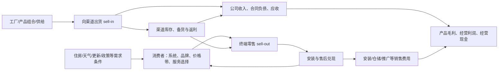

# 格力家用空调：研究用机制地图

状态：`MECHANISM_DISCOVERY / NO_VALUE_CAPTURE_CLAIM / NO_VERDICT`  
目的：把空调行业中“需求、渠道、安装服务、库存、量价、会计现金”可能相互作用的顺序画出来，决定下一轮阅读和取证优先级。它不是研究报告章节、正式 industry architecture、格力护城河判断或 H-A/H-B 的裁决。

## 使用方法

这张图先区分三种东西：

1. **经济上的必要环节**：消费者必须购买、交付、安装和使用产品；厂商必须经由某种交易点和现金转换获得收入。
2. **公司已披露的行动或会计事实**：例如渠道网络、预收经销商货款、销售返利和安装/仓储费用。
3. **仍未知的竞争事实**：格力是否控制某一接口、客户为何选择、某项服务是否产生切换成本、经销库存和实际 sell-out 如何变化。

只有第三类中的未知被同口径外部或公司材料回答，且令 H-A/H-B 出现不同的后续序列时，才有资格进入正式的 `industry_architecture` 或 CJO。研究图的价值恰恰是把这些未知保留下来，而不是把网络、质保或排名涂成护城河。

图中的箭头是待研究的传导假设，不是已证明的格力因果关系。尤其是 `sell-in → 库存 → sell-out` 与 `sell-out → 公司收入` 都可能受交易点、返利、收入确认、渠道结构和期间错配影响，不能用任意两条数据的差额填补。

## 当前已知的锚点

| 地图节点 | 可复读材料 | 能安全放入研究图的事实 | 仍不能说 |
|---|---|---|---|
| 渠道和服务网络 | 格力 2025 年年报 `CNINFO:000651:ANN:20260429:1225250396`，pp. 10–11 | 公司披露 30 个区域销售公司、超过 2 万家销售门店、超过 3 万家专业服务网点，并说明线上使用自建平台和第三方旗舰店。 | 网点数量不等于客流、渠道效率、全渠道份额、终端控制权或客户锁定。 |
| 渠道数字化和库存管理 | 同一年报，pp. 10–11 | 公司称建设了线上线下融合渠道、基地仓/区域仓以及数字化营销体系。 | 这是 `ACTION_COMMITMENT / CAUSAL_ATTRIBUTION`，不是库存健康、返利下降或实际 sell-out 改善的验证。 |
| 经销交易与现金时间差 | 同一年报，p. 164 | 年末合同负债 152.07 亿元，附注明确“主要是预收经销商的货款”。 | 单期合同负债不能单独证明需求、渠道库存、收入质量或普通股可分配现金。 |
| 渠道激励/费用位置 | 同一年报，p. 167、p. 174 | 年末销售返利 485.71 亿元；销售费用 84.11 亿元，注释称安装、仓储装卸、宣传推广和职工薪酬合计占销售费用逾 80%。 | 余额和费用科目没有按家用空调、渠道或单笔交易分解；不能由此反推 ASP、促销强度、实际返利率或经销库存。 |
| 线上相对位置 | 格力 2023–25 年报转引的奥维数据，见[状态转换编年](GREE_V1_STATE_TRANSITION_CHRONOLOGY.md) | 家用空调线上零售额份额从 28.15% 降到 24.31%，均为年报所转引的同定义线上序列。 | 不能代表线下/全渠道、销量份额、价格带或公司的会计收入。 |
| 产品/工程市场的分叉 | 格力 2025 年年报，pp. 11–15 | 公司同时经营家用空调、家庭中央空调与更广的暖通设备；产品、客户和交付场景并非同一个市场。 | 中央空调的公司陈述或行业排名不能外推为家用空调终端竞争位置。 |

金额只用于指出研究节点的材料性，而不构成正常化现金、估值或资本回报结论。年报里的渠道/服务表述按[管理层陈述协议](GREE_V1_MANAGEMENT_STATEMENT_PROTOCOL.md)仍是行动或归因，不是独立结果证据。

渠道会计科目本身也有口径断点：2024 年报把部分质量保证支出从销售费用重列为营业成本，并追溯调整了 2023 年。已将这个边界、连续余额和不能作出的推断单列在[渠道经济会计边界研究笔记](GREE_CHANNEL_ECONOMICS_ACCOUNTING_BOUNDARY.md)；它是研究中的反误读装置，不是渠道结论。

## 这张图如何使 H-A/H-B 真正不同

| 箭头 | H-A：渠道/价格带重配 | H-B：广泛竞争和价格实现恶化 | 最小可读观察 |
|---|---|---|---|
| 终端选择 → 渠道零售 | 低价线上份额可弱，但其他渠道/价格带相对位置稳定。 | 弱势扩散到线下/全渠道或同一顾客选择集合。 | 同 provider、同品牌/产品/地域/渠道/分母的 sell-out 或公开、同定义公司比较。 |
| 渠道库存/激励 → 收入与费用 | 库存、返利、安装/物流成本与较稳定的终端位置相容，不能持续恶化。 | 促销、返利、费用或存货/应收压力先于或伴随收入走弱。 | 公司分部或渠道口径的返利、费用、库存、收现和应收；没有共同边界即为 `UNKNOWN`。 |
| 服务兑现 → 消费者选择 | 售后/安装能使高端或线下选择保持，但必须有客户或相对位置证据。 | 服务网络存在却未阻止同一消费者选择竞争者，或成本上升而未保留终端位置。 | 服务时效、保修成本、客户选择或同口径价格带份额；网点数和公司自评都不够。 |
| 产品/工程组合 → 产品毛利 | 退出低价销量、保留更高价值组合可解释部分毛利稳定，且应与其他渠道证据一致。 | 组合暂时掩盖价格/费用恶化，之后应在 ASP、费用、营运资本或更广渠道位置显现。 | 同一产品分类的销量、ASP、返利/佣金、销售费用和毛利；不得跨“空调/消费电器”分类拼接。 |

两侧都不预设正确。若将来观察只显示“毛利未塌”或“仍为第一”，它仍落在双方共有区，不能裁决；若测量边界不一致，优先重开箭头而不是让任一方获胜。

## 接下来按信息价值阅读，而不是按报告章节阅读

1. **交易点与库存边界**：先找同版本的品牌 sell-out、shipment 和库存定义，确定各自观察的是谁持有库存、何时发生交易；没有定义时，任何数值仍只作方向传感器。
2. **渠道经济的公司传导**：从 2021–25 年报连续提取合同负债、销售返利、销售费用、销售收现、应收、存货和应付的同口径 observation；先判断哪些是账面状态、哪些能够证明变化原因。
3. **消费者与服务接口**：寻找能区分“服务是可迁移成本还是选择锁定”的客户、安装、保修兑现或价格带证据，而不是重复公司网络规模。
4. **市场分层**：把家用分体、家庭中央、商用工程和出口分开；任何“第一”都先标明具体市场、单位、渠道和交易点。
5. **红队**：每发现一条支持渠道升级的材料，同时问它是否同样可由渠道压货、费用重新分类、产品组合、补贴或出口转移解释；能同时解释的材料只增加问题，不增加信念。

## 研究边界

根因是 `DATA_COVERAGE + REASONING`，不是报告写作。当前缺的并非“更多观点”，而是能把图中若干关键箭头从 `UNKNOWN` 变为可区分观察的资料：全渠道/线下相对位置、品牌量价/价格带、库存归属、返利/佣金的渠道分解、安装售后的客户选择效应，以及这些变化对现金的共同边界。

禁止把公司自述、门店数、线上排名、单期毛利、合同负债、销售返利或供应商总行业数单独解释成渠道护城河、竞争恶化、正常 owner cash 或资本配置质量。接纳标准不是把图填满，而是每条可能改变 H-A/H-B 的箭头都明确了：当前事实、最强替代解释、下一项取证和若不可得时的保守 `UNKNOWN`。
